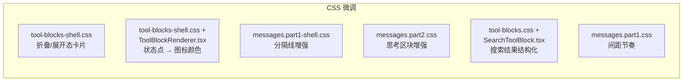

# 输出区域精致度提升 — 实现计划

---

## Summary

通过 CSS 微调快速提升对话输出区的视觉基线质感：工具卡片容器感、状态指示器降噪、边界分隔线、思考区块、搜索结果结构化、消息-工具间距节奏。聚焦 Phase 1（R1-R11），不引入新的组件或布局结构。

---

## Problem Frame

当前输出区域所有工具调用以相同视觉权重渲染——卡片边框、绿色状态点、行内文字均匀堆叠。连续操作时屏幕变成"卡片墙"，缺乏主次之分。折叠态卡片 `border-color: transparent` 几乎没有容器感，绿色状态点在每个工具行重复出现，搜索结果像原始日志平铺。

用户期望从"能用"达到"精致"，参考对标：Linear 工具卡片、Raycast 搜索结果、Arc 边界分隔线。

(see origin: `docs/brainstorms/2026-05-30-output-area-refinement-requirements.md`)

---

## Requirements

### Phase 1: CSS 视觉基线

#### 工具卡片

R1. 折叠态 `.task-container` 需要轻微底色，使用 `color-mix()` 与消息背景混合。

R2. 展开态 `.task-container` 需要微妙阴影和柔和边框，与背景形成视觉分离。

R3. 状态指示器简化：Phase 1 将绿色圆点替换为工具图标本身的颜色状态（成功=绿色，失败=红色，处理中=黄色），减少重复绿点噪音。

#### 边界分隔线

R4. 转场边界 `.messages-turn-boundary` 增加上下间距（`14px 0 10px` → `20px 0 16px`）。

R5. 分隔线渐变端点提高不透明度，标签字距从 `0.03em` 增至 `0.06em`。

#### 思考区块

R6. 思考区块 `.thinking-block` 展开态增加轻微背景色和圆角。

R7. 思考区块左侧 border 从 1px 增至 2px，处理中状态使用主题色高亮。

#### 搜索结果

R8. 搜索结果中文件名行加粗并添加浅色背景。

R9. 匹配行添加左侧 accent border + 缩进。匹配关键词用 `mark` 高亮。

R10. 空搜索结果使用更小字号、斜体、淡色，视觉降权。

#### 间距节奏

R11. 工具区块与下一个非工具消息之间的间距大于工具区块之间的间距。

---

### Phase 2: 时间轴流式布局

#### 时间轴结构

R12. 输出区域引入竖线 + 节点串联所有工具操作，替代当前独立卡片堆叠。

R13. 每个操作节点由节点圆点 + 摘要行组成，节点圆点反映操作状态。

R14. 处理中的操作节点使用脉动动画高亮。

#### 折叠/展开交互

R15. 已完成操作默认折叠为单行摘要，点击展开查看详情。

R16. 处理中操作默认展开，完成时自动折叠为摘要行。

R17. 展开后详情复用现有工具块渲染逻辑。

#### 空间紧凑化

R18. 相同类别连续操作在时间轴中视觉归组。

R19. 操作间纵向间距收紧至 `4px`。

---

## Key Technical Decisions

KTD1. **CSS-only 微调，不引入新组件** — 所有改动通过修改现有 CSS 文件和少量组件 class 实现，最小化风险。搜索结果结构化（U5）需要在 SearchToolBlock.tsx 中添加行级解析逻辑，但不改变组件结构。

KTD2. **状态指示器用图标颜色替代独立圆点** — 复用现有 `.tool-inline-icon` 的 `.completed`/`.processing`/`.failed` 状态类，图标本身反映状态颜色，减少重复绿点噪音。

KTD3. **搜索结果按行解析需要启发式** — grep 输出格式多样（有/无行号、有/无文件名），解析逻辑采用启发式匹配：文件名行（以 `:` 结尾）、匹配行（`文件名:行号:` 模式）、空结果文本。

---

## High-Level Technical Design

### CSS 修改热力图

所有改动均为 CSS 文件修改 + 一处组件 class 添加（SearchToolBlock），无新组件。

---

## Scope Boundaries

- **不改底层分组逻辑** — `groupToolItems` 分类和合并规则不变
- **不改数据模型** — `ConversationItem` 和 `ToolItem` 类型不动
- **不改展开后的渲染** — markdown 渲染、diff 视图、命令输出不变
- **不新增工具块类型** — 不引入新 ToolBlock 变体
- **不引入时间轴组件** — 聚焦 CSS 微调，不做结构性布局变更
- **虚拟化逻辑不变** — `@tanstack/react-virtual` 机制保持不变

---

## Implementation Units

### U1. 工具卡片视觉精修

**Goal:** 让折叠态和展开态的 task-container 有明确的视觉层级和容器感。

**Requirements:** R1, R2

**Dependencies:** None

**Files:**
- `src/styles/tool-blocks-shell.css` — 修改 `.task-container` 折叠/展开态样式

**Approach:**
- 折叠态：当前 `border-color: transparent; border-radius: 0`，改为 `background: color-mix(in srgb, var(--surface-card) 60%, var(--surface-messages)); border-radius: 6px; border-bottom-color: color-mix(in srgb, var(--border-subtle) 50%, transparent)`
- 展开态：当前 `border: 1px solid var(--border-subtle)`，增加 `box-shadow: 0 1px 3px color-mix(in srgb, #000 6%, transparent)`，边框颜色改为 `color-mix(in srgb, var(--border-subtle) 70%, transparent)`
- 折叠态的 `.tool-change-collapsed-card` 和 `.tool-change-stack-entry` 同步更新背景色规则

**Patterns to follow:** 现有 `color-mix()` 用法模式（参考 `panel-lock.css`、`spec-hub.controls.css`）

**Test scenarios:**
- Dark theme: 折叠态卡片有若隐若现的底色，与 `--surface-messages` 背景有可辨识差异
- Light theme: 折叠态卡片同样可见，不刺眼
- 展开态卡片有轻微浮起感（shadow），不突兀
- 折叠/展开切换时无视觉跳变

**Verification:** 在深色和浅色主题下，检查连续读文件、搜索结果、编辑操作的折叠/展开态视觉效果。

---

### U2. 状态指示器简化

**Goal:** 消除每个工具行右侧重复的绿色圆点噪音，改用图标颜色状态。

**Requirements:** R3

**Dependencies:** None

**Files:**
- `src/styles/tool-blocks-shell.css` — 添加 `.tool-status-indicator.hidden` 隐藏规则
- `src/styles/tool-blocks.css` — 添加 `@media (prefers-reduced-motion: reduce)` 覆盖 `tool-block-breathing` 动画
- `src/features/messages/components/toolBlocks/ToolBlockRenderer.tsx` — 添加连续同组工具隐藏非末尾状态点的逻辑
- `src/features/messages/components/toolBlocks/toolConstants.ts` — 可能需要辅助函数判断是否为组内非末尾项

**Approach:**
- 工具图标（`.tool-title-icon`）添加状态颜色：`.completed` → `var(--color-success)`，`.error` → `var(--color-error)`，`.pending` → `var(--color-warning)`
- 连续同类工具中，非末尾项的 `.tool-status-indicator` 添加 `hidden` class（`opacity: 0`），只在最后一个显示状态点
- ReadToolGroupBlock 等 group block 内的子项同样适用此规则
- 无障碍：在 `tool-blocks.css` 中添加 `@media (prefers-reduced-motion: reduce) { .tool-status-indicator.pending, .tool-block-dot.pending { animation: none; } }`

**Patterns to follow:** 现有 `.tool-inline-icon.completed` 的颜色逻辑（`messages.part1.css:1604`）

**Test scenarios:**
- 连续 5 个读文件操作：前 4 个无状态点，最后一个显示绿色完成点
- 单个工具操作：正常显示状态点
- 失败操作：状态点显示红色，图标也变红
- 处理中操作：状态点和图标均显示黄色 + 呼吸动画

**Verification:** 检查连续读文件、连续搜索、混合操作序列的状态点显示。

---

### U3. 边界分隔线增强

**Goal:** 让推理过程和最终消息之间的分隔线在快速滚动时更易识别。

**Requirements:** R4, R5

**Dependencies:** None

**Files:**
- `src/styles/messages.part1-shell.css` — 修改 `.messages-turn-boundary` 及相关样式

**Approach:**
- 间距：`margin: 14px 0 10px` → `margin: 20px 0 16px`
- 渐变端点不透明度：`color-mix(in srgb, var(--border-strong) 26%, transparent)` → `color-mix(in srgb, var(--border-strong) 40%, transparent)`（两处）
- 标签字距：`letter-spacing: 0.03em` → `letter-spacing: 0.06em`

**Patterns to follow:** 现有渐变 + `clip-path` 模式不变，仅调整参数值

**Test scenarios:**
- 分隔线上下间距明显增大，视觉上更容易定位
- 渐变线端点更清晰，中间渐隐效果保留
- 标签文字间距微增，辨识度提高

**Verification:** 在有推理过程的对话中滚动检查分隔线。

---

### U4. 思考区块增强

**Goal:** 让思考区块在展开后有明确的视觉分离，不再仅靠 1px 边框。

**Requirements:** R6, R7

**Dependencies:** None

**Files:**
- `src/styles/messages.part2.css` — 修改 `.thinking-block` 和 `.reasoning-markdown-surface`

**Approach:**
- 展开态：`.thinking-block.is-expanded` 添加 `padding: 8px 10px; border-radius: 6px; background: color-mix(in srgb, var(--surface-card) 50%, var(--surface-messages))`
- 左侧 border：`.reasoning-markdown-surface` 的 `border-left: 1px solid` → `border-left: 2px solid`
- 处理中状态：`.thinking-block.is-live .reasoning-markdown-surface` 的 `border-left-color` 提高不透明度

**Patterns to follow:** 现有 `color-mix()` 背景混合模式

**Test scenarios:**
- 思考区块展开后有轻微背景色，与消息背景有视觉分离
- 左侧 border 2px，处理中时绿色高亮
- 折叠态无变化

**Verification:** 检查包含推理过程的消息。

---

### U5. 搜索结果结构化

**Goal:** 让搜索结果从原始日志变为有层级的结构化展示。

**Requirements:** R8, R9, R10

**Dependencies:** None

**Files:**
- `src/features/messages/components/toolBlocks/SearchToolBlock.tsx` — 添加语义化 class
- `src/styles/tool-blocks.css` — 添加搜索结果专用样式

**Approach:**
- SearchToolBlock 展开态输出中，按行解析：文件名行添加 `.search-result-file-header` class，匹配行添加 `.search-result-match-line` class
- 文件名 header：`font-weight: 600; font-size: 12px; color: var(--text-strong); padding: 2px 6px; border-radius: 4px; background: color-mix(in srgb, var(--color-accent, #3b82f6) 8%, transparent)`
- 匹配行：`font-family: var(--code-font-family); font-size: 11.5px; padding: 1px 0 1px 12px; border-left: 2px solid color-mix(in srgb, var(--color-accent, #3b82f6) 30%, transparent)`
- 空结果："No matches found" → `font-size: 11px; color: var(--text-faint); font-style: italic`
- 匹配关键词高亮：在输出文本中检测搜索 pattern 并用 `<mark>` 包裹

**Patterns to follow:** 现有 `tool-blocks.css` 中的 `.tool-change-entry` 渐变背景模式

**Test scenarios:**
- grep 搜索结果：文件名行加粗有背景，匹配行有左侧 accent border
- glob 搜索结果：文件列表格式化
- 无匹配结果：视觉降权（小字、斜体、淡色）
- JSON 输出（如 MCP 工具结果）：保持现有 pretty-print 格式

**Verification:** 执行 grep/glob 搜索，检查展开态的搜索结果格式。

---

### U6. 消息-工具间距节奏

**Goal:** 让工具区块和消息之间的间距有语义分层，形成视觉节奏。

**Requirements:** R11

**Dependencies:** None

**Files:**
- `src/styles/messages.part1.css` — 添加 `.message-tool-block-shell` 间距规则

**Approach:**
- `.message-tool-block-shell` 保持现有 margin（`margin: 8px 0` 来自 `.task-container`）
- 添加：`.message-tool-block-shell + .message:not(.message-tool-block-shell)` → `margin-top: 12px`（工具后接消息时增加间距）
- 添加：`.message-tool-block-shell:last-child` → `margin-bottom: 4px`（消息末尾的工具块减少下边距）

**Patterns to follow:** 现有 `.message { margin-bottom: 12px }` 间距体系

**Test scenarios:**
- 工具块与工具块之间：紧凑（4-8px）
- 工具块与助手消息之间：宽松（12px+）
- 单条消息末尾只有一个工具块：下边距收紧

**Verification:** 滚动查看包含多条工具操作和消息的对话。

---

## Risks & Dependencies

1. **color-mix() 兼容性** — Tauri WebView 应支持，但需验证。降级方案：使用固定 RGBA 值回退。
2. **搜索结果解析复杂度** — U5 是最复杂的改动，需要将 `<pre>` 纯文本渲染改为行级结构化渲染，且 grep 输出格式多样。建议先处理最常见的 `-rnH` 格式，其他格式渐进支持。
3. **inline style 清理风险** — ReadToolGroupBlock 等组件有大量 inline style，其中部分是动态的（如 `maxHeight` 基于运行时计算）。清理时需区分静态和动态，只迁移静态部分。

---

## Deferred to Follow-Up Work

- 助手消息底色 — 影响面大，需独立验证
- 时间轴流式布局 — 确认 CSS 微调效果后再评估是否引入
