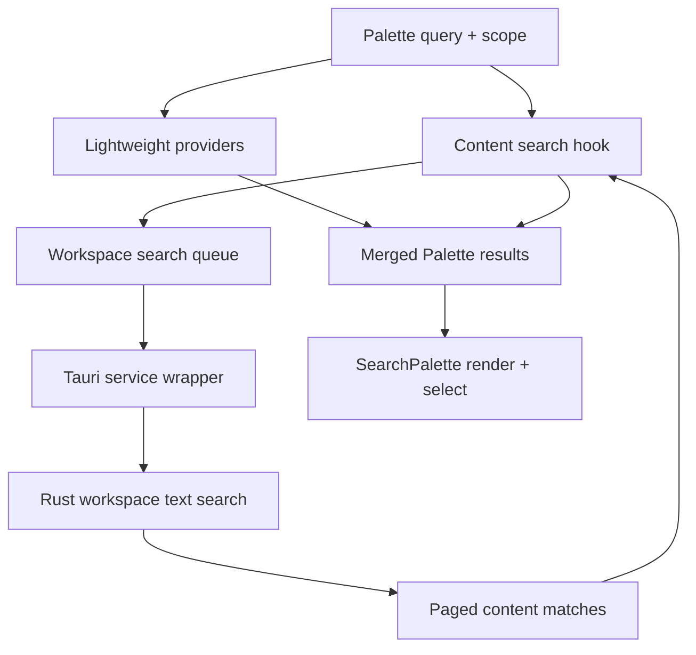
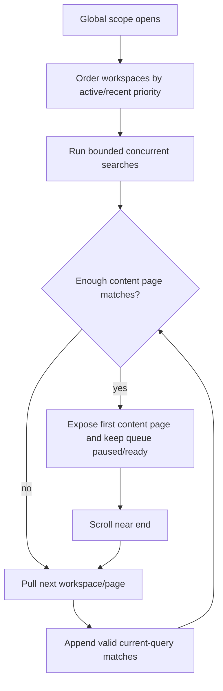

# Search Palette 文件内容搜索 — 实现计划

---

## Summary

为现有 Search Palette 接入高性能文件内容搜索：轻量结果保持即时返回，文件内容结果在 query settle 后异步补入；scope 跟随 Palette 当前/全局切换；首批展示 50 条 content match，并通过滚动懒加载继续获取后续结果。

---

## Problem Frame

Search Palette 当前已聚合 files、threads、messages、tasks、history、skills、commands，但 file 结果主要来自 path/name。用户记得代码片段、配置文本或文档内容时，需要离开 Palette 使用 Workspace Search Panel，破坏“一个入口找到下一步”的工作流。

性能是本计划的主约束。现有 Rust workspace text search 已具备 gitignore-aware scan、单文件大小上限、预览文本、line/column、limit-hit 等基础能力，但当前更适合一次性 workspace search panel，不适合 Search Palette 的 `50 + lazy load`、global progressive、stale query invalidation 体验。本计划优先扩展 existing contract，而不是在 frontend 逐文件读取或做假分页。

(see origin: `docs/brainstorms/2026-06-06-search-palette-file-content-requirements.md`)

---

## Requirements

**用户行为**

- R1. Search Palette 必须在普通 query 中自动包含文件内容结果，不要求用户输入特殊 prefix 或切换独立模式。
- R2. 文件内容搜索必须跟随现有 Palette scope：current scope 搜 active workspace，global scope 渐进搜索 eligible workspaces；若 current scope 下没有 active workspace，复用现有 Palette open fallback，按 global scope 处理而不是返回隐式空结果。
- R3. 文件内容搜索加载时，现有轻量结果仍必须可见且可选择。
- R4. 文件内容结果必须与文件 path/name 结果视觉区分，并显示 path、line/column、preview、workspace identity（global 且非 active workspace 时）。
- R5. 选择文件内容结果必须打开匹配文件，并尽可能定位到 matched line/column。

**性能与渐进加载**

- R6. 文件内容搜索必须有最小 query 长度、debounce/stale response 防护，避免每次短输入触发 expensive scan。
- R7. 首批 content results 默认最多展示 50 条；滚动接近末尾时再加载下一批。
- R8. Global scope 必须 bounded concurrency + partial result merge，不等待所有 workspace 完成后才显示。
- R9. Global scope 的 workspace 搜索顺序必须优先 active/recent workspace，再补齐其他 workspace。
- R10. Search Palette 关闭时不得继续消费 hot file-content search work；未完成请求返回也不得更新已关闭或已变更 query 的 UI。

**兼容与边界**

- R11. Dedicated Workspace Search Panel 的 advanced controls（regex、case sensitive、whole word、include/exclude glob）首版不进入 Palette。
- R12. 现有 `searchWorkspaceText` 使用方必须保持兼容，或者通过显式 adapter 保持旧 panel 行为不漂移。
- R13. 不引入 persistent full-text index；不在 frontend 逐个 `readWorkspaceFile` 扫内容。
- R14. 现有 Palette keyboard behavior（Esc、Enter、ArrowUp/Down、IME composition guard）必须保持。

---

## Key Technical Decisions

- KTD1. **扩展 backend pagination/progressive contract，而不是 frontend 假分页。** 用户要求的 50 条默认 + 懒加载是性能边界，不只是渲染裁剪；后端需要支持 page size、cursor/continuation 或等价机制，让下一批搜索能继续扫描而不是重复全量扫描。Continuation 可以是 opaque string，但语义上必须至少表达 normalized file path + file 内 match 位置，不能只记录 file index 或 file path。
- KTD2. **内容搜索从轻量 `useUnifiedSearch` 旁路异步补入。** `computeUnifiedSearchResults` 保持 pure/synchronous provider aggregation；文件内容搜索由独立 hook 编排 Tauri calls、stale guards、global concurrency 和 partial result state，最终由 app-shell search radar section 负责合并、去重、排序并输出既有 `searchResults` contract 给 Palette。
- KTD3. **Global progressive 优先 active/recent workspace，而不是完美全局排序。** 首版目标是快速可用：当前和近期 workspace 先出结果，其他 workspace 以 bounded queue 追加。跨 workspace 的完美 relevance ordering 延后。
- KTD4. **新增 content result kind/source，而不是复用 file kind。** Content match 需要 line/column、preview、match count、workspace identity 和不同 badge；复用 `file` 会让 selection、render 和 ranking contract 混淆。
- KTD5. **高级搜索留在 Workspace Search Panel。** Palette 首版只处理普通文本 query；regex/case/whole-word/include/exclude 继续由 dedicated panel 承担，避免快速入口变重。
- KTD6. **取消能力先探测再定实现。** U1/U3 开始时必须先确认 Tauri invoke / remote daemon 是否支持 request cancellation；若不支持首版真正取消，则必须在 plan execution note 中记录最大 expected stall budget，并把 Rust scan budget/limit 作为硬保护，而不是只依赖 frontend stale guard。

---

## High-Level Technical Design

### Search data flow

### Global progressive loading

---

## Scope Boundaries

### In Scope

- Search Palette 普通 query 自动触发文件内容搜索。
- 当前/全局 scope 下的 content result 合并、展示、选择打开。
- Backend text search contract 的分页/continuation 扩展。
- Frontend stale response、concurrency、lazy load、partial progress 状态。
- Focused unit/component/Rust tests 覆盖关键行为。

### Deferred to Follow-Up Work

- Regex、case sensitive、whole word、include/exclude controls 进入 Palette。
- Persistent full-text index 或预构建 workspace content cache。
- 完美 global relevance ranking。
- Raycast-style action menu / command center 化。
- Content result 高亮具体 matched substring 的富文本渲染。

---

## System-Wide Impact

- **Cross-layer contract:** 触及 `src/services/tauri.ts` 与 `src-tauri/src/workspaces/**` 的 request/response mapping，需要保持 remote backend payload 兼容。
- **Remote daemon contract:** 本仓库存在 remote mode / separate daemon；`search_workspace_text` 的分页字段若进入 Tauri command，也必须同步确认 daemon bridge 是否需要 schema/handler 更新，不能只改 frontend bridge 和 local Rust path。
- **Search performance:** 触及 Palette 的全局搜索路径，必须避免 hidden search、closed Palette、short query 触发重扫描。
- **UI contract:** Search Palette 的 keyboard/IME/selection 行为是既有回归面，新增 content result 不能改变现有 result kind 的打开语义。
- **Navigation contract:** 选择 content result 需要把 file path + line/column 传到现有文件打开链路；若当前 `handleOpenFile` 只支持 path，必须在 app-shell 边界扩展结构化 location 参数或添加专用 helper，不能把 line/column 只塞进 display label。
- **Testing posture:** 这是 cross-layer feature，计划要求先补 pure mapping/hook/component/Rust focused coverage，再接 UI wiring。

---

## Implementation Units

### U1. Backend content search pagination contract

**Goal:** 扩展 workspace text search，使其支持 Search Palette 所需的 50 条首批和后续 lazy load，而不是一次性全量返回。

**Requirements:** R2, R7, R8, R12, R13

**Dependencies:** None

**Files:**
- `src-tauri/src/workspaces/files.rs`
- `src-tauri/src/workspaces/commands.rs`
- `src-tauri/src/command_registry.rs`
- `src-tauri/src/bin/cc_gui_daemon.rs`（确认 remote daemon handler / bridge 是否需要同步）
- `src-tauri/src/remote_backend.rs`（确认 remote payload / unsupported signal 语义）
- `src/services/tauri.ts`
- `src/services/tauri.test.ts`

**Approach:**
- 在现有 `WorkspaceTextSearchOptions` / response contract 上增加 optional 分页输入与 continuation 输出，保留旧调用的默认行为。
- Page size 默认服务 Palette 的 50 条 match 目标，但 backend contract 应支持 caller 显式传入 limit。
- Cursor/continuation 需要能表达“继续同一 workspace 的后续扫描”，最小语义是 normalized file path + file 内已返回 match position；可序列化为 opaque string，但不能依赖不稳定 file index，也不能只记录“扫到某文件”。
- Cursor position 推荐使用 byte offset 或 line+column/resume offset，而不是 match index alone；若实现选择 match index，必须证明它不会要求先重扫并收集所有 prior matches 才能返回下一页。
- Cursor 对文件内容变化采用 fail-soft 语义：如果 continuation 指向的 file 不存在、mtime/size/content fingerprint 不匹配、或 resume position 不可验证，backend 返回 degraded restart/invalid-cursor signal，由 hook 丢弃旧 page 或重启当前 query，而不是继续返回可能错位的 match。
- 分页扫描必须定义 stable traversal contract：同一 workspace/query/options 下按 deterministic normalized path order 或等价稳定顺序推进，避免不同 walk order 让 continuation 重复或跳过结果。
- Remote backend payload 同步携带 optional 新字段；旧字段语义保持不变，保证 Workspace Search Panel 不漂移。若 remote backend 暂未支持新增字段，caller 必须得到明确 unsupported/fallback signal，不能静默回到全量搜索后由 frontend 裁剪。
- Response 保留 `limit_hit` 或等价 degraded/progress signal，让 UI 能展示“还有更多/已截断/部分完成”。

**Execution note:** 先做 cancellation capability check 与 cursor executable test/spike：确认 Tauri local path、remote daemon path 是否能取消或被 scan budget 硬限制；确认 cursor 能在 walk/resume 时不重复不漏。通过后再调整 frontend service mapping。

**Patterns to follow:**
- `src-tauri/src/workspaces/files.rs` 现有 `search_workspace_text_inner` 的 gitignore-aware walk、file-size guard、binary skip、preview build。
- `src/services/tauri.ts` 现有 service wrapper 统一映射 Tauri command，不在 feature 中直接 `invoke()`。

**Test scenarios:**
- Rust: 普通旧调用不传分页字段时，仍返回与现有 workspace search panel 兼容的 response。
- Rust: `limit=50` 时，结果最多包含 50 条可展示 match，并返回可继续的 cursor/continuation。
- Rust: 使用 continuation 拉取下一页时，不重复返回第一页已返回的 match。
- Rust: 单文件超过 page size、跨文件刚好跨 page size、以及文件 A/B 都有多 match 时，continuation 不重复、不漏 match。
- Rust: 文件 A 有少量 match、文件 B 有超过 page size 的 match 时，第一页包含 A + B 部分 match，第二页从 B 的正确位置继续。
- Rust: continuation 对应文件被修改/删除时返回 invalid/degraded signal，不返回错位 match。
- Rust: continuation 对同一 query/options 有效；query/options 变化时旧 continuation 被拒绝或忽略，不能跨条件复用。
- Rust: include/exclude pattern、binary skip、>1MB file skip、gitignore-aware skip 在分页模式下仍生效。
- Rust/remote: local Tauri path 与 remote daemon path 对新增 optional payload 字段行为一致；不支持分页时返回显式 unsupported/degraded。
- Service mapping: `searchWorkspaceText` 传入 pagination fields 时，Tauri payload 字段正确；不传时 payload 保持旧调用兼容。
- Service mapping: optional pagination fields 区分 `undefined`（旧兼容默认）与显式 `null`/cursor 值，避免误触发 fallback。
- Service mapping error path: backend reject 时 wrapper 不吞异常，caller 可以得到可读错误。

**Verification:** 旧 Workspace Search Panel 行为保持；新分页 contract 能稳定返回 first page + continuation + next page。

### U2. Search content result types and provider mapping

**Goal:** 为文件内容结果建立明确的 frontend result contract，避免和 file path/name result 混用。

**Requirements:** R1, R4, R5, R9

**Dependencies:** U1

**Files:**
- `src/features/search/types.ts`
- `src/features/search/providers/filesProvider.ts`
- `src/features/search/providers/contentProvider.ts`
- `src/features/search/providers/contentProvider.test.ts`
- `src/features/search/ranking/score.ts`
- `src/features/search/ranking/score.test.ts`

**Approach:**
- 扩展 `SearchResultKind` / `sourceKind`，新增 content-specific kind/source。
- Content result contract 包含 workspaceId、workspaceName、filePath、line、column、preview、match ordinal 或 stable match identity。
- 新增 pure mapper，把 backend `WorkspaceTextSearchResponse` page 转成 Palette `SearchResult[]`。
- Ranking 只做基础 score 与 active/recent bias，不尝试在首版实现全局完整排序。
- Result id 必须稳定且足够唯一，避免 recency/open tracking 与 selection index 混淆。
- Filter 归属按独立 `content` 处理：`all` 与 `content` filter 下显示 content results；`files` filter 只显示文件 path/name 结果，`sourceKind: "content"` 用于 badge/source label。

**Patterns to follow:**
- `src/features/search/providers/messageProvider.ts` 的 snippet/location result shape。
- `src/features/search/providers/filesProvider.ts` 的 file result mapping。
- `src/features/search/ranking/score.ts` 的 score + recency sorting contract。

**Test scenarios:**
- Pure mapper: 单文件多 match 映射为多个 content results，包含 path、line、column、preview。
- Global mapper: 非 active workspace result 包含 workspace label。
- ID stability: 同一 workspace/path/line/column/query page 返回稳定 id。
- Filter mapping: `all` / `content` 包含 content result；`files` 只包含 path/name file result，其它 filter 不误显示 content result。
- Ranking: active workspace content result 在同等基础分下优先于其他 workspace；recency boost 不破坏稳定排序。
- Edge: 空 backend response 返回空 content results。

**Verification:** Content results 可独立渲染、排序、选择，不影响 file path result。

### U3. Palette content search orchestration hook

**Goal:** 建立异步 content search orchestration：debounce、minimum query、stale guard、global bounded concurrency、partial merge、lazy load trigger。

**Requirements:** R1, R2, R3, R6, R7, R8, R9, R10, R11

**Dependencies:** U1, U2

**Files:**
- `src/features/search/hooks/usePaletteContentSearch.ts`
- `src/features/search/hooks/usePaletteContentSearch.test.ts`
- `src/features/search/perf/limits.ts`
- `src/features/search/perf/searchMetrics.ts`
- `src/app-shell-parts/useAppShellSearchRadarSection.ts`
- `src/app-shell-parts/useAppShellSearchRadarSection.test.tsx`

**Approach:**
- 新增 feature-local hook，输入 query、scope、workspace priority list、isPaletteOpen 和 load-more signal，输出 contentResults、status、hasMore、loadMore。
- 最小 query 长度作为常量放在 `perf/limits.ts`，避免 magic number 分散。
- Global concurrency 上限作为常量放在 `perf/limits.ts`，首版默认 `PALETTE_CONTENT_SEARCH_MAX_CONCURRENCY = 3`；测试必须断言同时 in-flight workspace search 不超过该值。
- 每轮 query/scope/open state 生成 request generation token；旧 response 到达时直接忽略。
- Current scope 只搜索 active workspace；若无 active workspace，先通过 existing `resolveSearchScopeOnOpen` fallback 到 global，再按 global scope 搜索。global scope 通过 active/recent-first workspace queue + bounded concurrency 拉取 pages。
- Palette 关闭或 query 变空时清空 content search state，并阻止后续 response 更新 UI；首版若 Tauri invoke 不可取消，最低要求是停止发起新 request + stale guard 忽略旧响应，并在风险中保留 backend cancellation follow-up。
- U3 开始前必须消费 U1 的 cancellation capability result：若不可真正取消，hook 不得在 query churn/global scope 下主动预取超过当前可见 batch，并必须依赖 backend scan budget 防止单 request 长时间占 CPU。
- Lazy load 不应自动无限追后台：只有用户滚动接近末尾，或 visible content batch 少于目标且仍有当前 workspace/page continuation 时，才继续取下一批。
- Hook 输出的 `contentResults` 是 content 内部 page 结果；app-shell merge 后仍受 Palette 总结果上限约束，但 content hook 自身首批最多保留/暴露 50 条 content match，避免 lightweight results 抢占导致后台无限补齐。
- Global queue 策略为 active/recent-first FIFO；达到 concurrency 上限时 pending workspace 保留在队列中，不 drop oldest。query/scope generation 变化时整队列失效并重建。

**Execution note:** Hook 属于 cross-layer async orchestration，先补 race/cleanup tests 再接入 app-shell。

**Patterns to follow:**
- `.trellis/spec/frontend/hook-guidelines.md` 的 cancelled/stale response pattern。
- `src/app-shell-parts/useAppShellSearchRadarSection.ts` 现有 “Palette closed 时不喂 hot thread items” 性能保护。
- `src/features/search/hooks/useUnifiedSearch.ts` 的 debounce 与 immediate empty-result behavior。

**Test scenarios:**
- Covers F1 / AE1. Query settle 后先保留 lightweight results，再追加 current workspace content results。
- Covers F2 / AE2. Global scope 按 active/recent priority 触发 bounded workspace searches，content hook 首批最多暴露 50 条 content match。
- Bounded concurrency: global scope 同时 in-flight workspace searches 不超过 `PALETTE_CONTENT_SEARCH_MAX_CONCURRENCY`，后续 workspace 按 FIFO 补位。
- Covers F3. 快速输入 `abc` -> `abcd` 时，`abc` 的后返回 response 不更新 state。
- Scope stale: current scope 搜索请求未完成时切到 global（或反向切换），旧 scope response 不更新 state。
- No active workspace: current scope 下 active workspace 为空时走 global fallback，不调用 `searchWorkspaceText` 的空 workspaceId。
- Palette close: close 后未完成 request resolve，不更新 contentResults。
- Short query: 小于最小长度时不调用 `searchWorkspaceText`。
- Lazy load: scroll/loadMore signal 后拉取下一页，不重复第一页 match。
- Error path: 单 workspace search failure 记录 error/degraded state，但不清空其他 workspace 已返回结果。

**Verification:** Hook 在 fake timers / mocked service 下覆盖 success、stale、error、global partial、lazy load。

### U4. Merge content results into Palette state and selection

**Goal:** 把异步 content results 合并进 Search Palette 结果流，并支持打开 matched file location。

**Requirements:** R1, R3, R5, R14

**Dependencies:** U2, U3

**Files:**
- `src/app-shell-parts/useAppShellSearchRadarSection.ts`
- `src/app-shell-parts/useAppShellSearchAndComposerSection.ts`
- `src/app-shell-parts/renderAppShell.tsx`
- `src/app-shell-parts/useAppShellSearchRadarSection.test.tsx`
- `src/app-shell.startup.test.tsx`

**Approach:**
- 将 `useUnifiedSearch` 的 lightweight results 与 content hook results 合并，保留现有 `searchResults` contract 给 `SearchPalette`。
- Merge owner 固定为 `useAppShellSearchRadarSection.ts`：该层负责调用 content hook、按 filter/scope/query 合并 lightweight + content results、去重、排序、裁剪，并向 `SearchPalette` 继续传单一 `searchResults`。
- `useAppShellSearchAndComposerSection.ts` 只负责 `handleSelectSearchResult` 的 content kind routing；不要在 selection 层重新 merge 或重新解释 content search state。
- Merge 策略必须保留 file path result 与 content match result：同一 file 既命中 path/name 又命中 content 时不互相去重；只对相同 content result id（workspace/path/line/column/query 或 stable match id）去重，避免 lazy page 重复。
- Palette merged result 总上限继续使用现有 `SEARCH_TOTAL_LIMIT`；content hook 首批 50 是 content source 内部上限，不保证最终 merged list 中一定可见 50 条 content result。排序不应让 content results 大量挤出高分 lightweight results，除非 score 明确更高。
- Selection movement 使用 merged visible results length；query/scope/filter 变化时继续 reset selected index。
- `handleSelectSearchResult` 增加 content kind 分支：select workspace（如需要）、打开文件，并传递 line/column。若现有 `handleOpenFile` 只接受 path，本单元必须扩展 app-shell file open boundary 或添加 `handleOpenFileLocation({ path, line, column })`，并保持旧 file result path-only 行为。
- Content filter 策略新增 visible `文件内容` filter button；`all` 与 `content` 过滤下可出现 content results，`files` 过滤只保留 path/name file results。
- 避免在 `isSearchPaletteOpen === false` 时计算或传入 hot content search inputs。

**Patterns to follow:**
- `handleSelectSearchResult` 现有 file/thread/message/kanban selection cleanup。
- `resolveSearchScopeOnOpen` 的 active/global scope fallback。
- Existing thread select editor preservation cleanup pattern。

**Test scenarios:**
- Selecting content result in active workspace calls file open with path + line/column.
- Selecting global content result from another workspace first switches/selects workspace, then opens file location.
- Query change resets selectedIndex against merged results.
- Duplicate policy: file path result 与同文件 content match 同时保留；重复 content page 不产生重复 item。
- Total limit policy: merged results 不超过 `SEARCH_TOTAL_LIMIT`，且 lightweight high-score results 不因 content append 被无条件挤出。
- Scope/filter change resets selectedIndex and drops stale content results for the previous scope/filter.
- Merged result count drives ArrowUp/Down wraparound and Enter selection; lightweight-only behavior remains unchanged when content results are empty/loading.
- Existing result kinds still route exactly as before.
- Palette closed state does not pass hot thread/content input into search path.

**Verification:** Search result selection remains deterministic across existing kinds and new content kind。

### U5. SearchPalette UI rendering, lazy-load trigger, and i18n

**Goal:** 让 content results 在 Palette 中可辨识、可滚动加载，并暴露轻量 progress/degraded 状态。

**Requirements:** R4, R7, R10, R11, R14

**Dependencies:** U2, U3, U4

**Files:**
- `src/features/search/components/SearchPalette.tsx`
- `src/features/search/components/SearchPalette.test.tsx`
- `src/styles/search-palette.css`
- `src/i18n/locales/en.part1.base.ts`
- `src/i18n/locales/zh.part1.ts`

**Approach:**
- 为 content kind 增加 badge/source label，并在 result body 中显示 preview、path、line/column。
- Result list 增加滚动容器触底/near-end 回调，通知 parent/hook loadMore；保持 keyboard selection 行为不变。当前 `SearchPalette` 是普通 DOM scroll container，首版用 `scrollTop + clientHeight >= scrollHeight - threshold` adapter；若未来改成 virtual list，再切换到 range/overscan adapter。
- `SearchPalette` 不拥有 content search state；props 只接收 merged `results`、轻量 `contentSearchStatus/hasMore`（如需要）和 `onLoadMoreContentResults` 回调。
- Footer 或 compact status line 显示 content loading / partial / more available 状态，文案必须轻，不把 Palette 变成 full search panel。
- Empty state 保持现有语义：无 query 不显示 stale results；query 有值但 content loading 时不误报完全无结果。
- CSS 保持现有 `search-palette-*` 命名和 overlay layout，不引入 nested cards。

**Patterns to follow:**
- `SearchPalette.tsx` 现有 IME composition guard、visible query sanitization、keyboard listener cleanup。
- `WorkspaceSearchPanel.tsx` 现有 preview/location 展示语义，但不要搬入 advanced controls。

**Test scenarios:**
- Content result 渲染 badge、path、line/column、preview、workspace tag。
- Scroll near bottom 调用 `onLoadMoreContentResults`，且重复 near-bottom 不造成无界重复调用。
- Scroll adapter: 普通 DOM scroll container 下使用 threshold 判定 near-end；content append 导致 scrollHeight 变化时不会连续触发 loadMore storm。
- Loading 状态下 lightweight results 仍可见，Enter 仍选择当前 active item。
- Empty query 时即使传入 stale content results，也不显示。
- IME composition 期间 Enter 不选择 content result。
- i18n: English/Chinese searchPalette labels 存在，不硬编码 UI 文案。

**Verification:** Palette UI 能清楚区分 content results，且 keyboard/mouse/scroll 行为保持顺滑。

### U6. Existing Workspace Search Panel compatibility

**Goal:** 确保 backend contract 扩展不破坏 dedicated Workspace Search Panel。

**Requirements:** R11, R12

**Dependencies:** U1

**Files:**
- `src/features/search/components/WorkspaceSearchPanel.tsx`
- `src/features/search/components/WorkspaceSearchPanel.test.tsx`
- `src/services/tauri.ts`
- `src-tauri/src/workspaces/files.rs`

**Approach:**
- Workspace Search Panel 继续使用 advanced controls 和旧的“搜索当前 workspace 全文”体验。
- 如果 service wrapper 新增 options，Workspace Search Panel 显式走 compatibility defaults。
- 若 backend response 增加 cursor/progress 字段，panel 可以忽略新字段；不要强制迁移 UI。

**Patterns to follow:**
- `WorkspaceSearchPanel.tsx` 现有 `searchWorkspaceText` effect cancellation 和 expanded file result behavior。

**Test scenarios:**
- Covers AE4. Workspace Search Panel 仍传递 regex/case/whole-word/include/exclude options。
- Panel 打开 match 仍传 line/column。
- 后端返回新增 cursor/progress 字段时，panel 渲染不受影响。
- 后端 error 仍显示可读错误，不崩溃。

**Verification:** Dedicated panel 的高级搜索能力作为首版非目标保留。

### U7. End-to-end search regression surface

**Goal:** 用 focused coverage 锁住跨层关键路径，避免内容搜索引入性能和行为回归。

**Requirements:** R1-R14

**Dependencies:** U1-U6

**Files:**
- `src/features/search/hooks/usePaletteContentSearch.test.ts`
- `src/features/search/components/SearchPalette.test.tsx`
- `src/app-shell-parts/useAppShellSearchRadarSection.test.tsx`
- `src/app-shell-parts/useAppShellSearchAndComposerSection.test.ts`（如现有测试结构不足，可新增 focused test）
- `src-tauri/src/workspaces/files.rs`
- `src/services/tauri.test.ts`

**Approach:**
- 以 origin acceptance examples 为核心，建立 hook/component/service/Rust 分层测试，不依赖全 app E2E。
- 性能测试关注“不触发”和“有限触发”：short query、closed Palette、stale query、global bounded concurrency。
- Existing lightweight search perf baseline 不应被 content async path 污染；`computeUnifiedSearchResults` 保持同步纯函数测试。

**Test scenarios:**
- Covers AE1. Lightweight result 立即存在，content result 后到且属于 current query。
- Covers AE2. Global content search 首批 50，scroll 后继续追加。
- Covers AE3. Global content result 展示 workspace/path/location/preview，select 打开 location。
- Covers AE4. Advanced controls 不出现在 Palette，仍在 Workspace Search Panel 生效。
- Regression: `computeUnifiedSearchResults` large-data baseline 不因 content search 改动变慢。
- Regression: Palette closed 时不调用 content search service。
- Regression: scope 切换时旧 content response 不污染新 scope results。
- Regression: `all`/`content` filter 能显示 content results，`files` filter 只显示 path/name file results，其它 filter 不显示 content results。
- Regression: content result selection 传递结构化 line/column，不只更新 display label。

**Verification:** Focused tests 覆盖 origin flows，且无新增 runtime-heavy parent mount 噪音。

---

## Acceptance Examples

- AE1. **Hybrid current search:** 当 Palette 在 current scope 搜 `codemoss`，file path/thread/message 等轻量结果先显示；query settle 后 content result 追加，并且后到 response 必须属于当前 query。
- AE2. **Global lazy load:** 当 global scope 搜常见词，Palette 首批 content results 不超过 50 条；用户滚动接近末尾后，继续追加下一批。
- AE3. **Open location:** 当 content result 来自另一个 workspace，结果显示 workspace、path、line/column、preview；选择后切到对应 workspace 并打开匹配文件位置。
- AE4. **Advanced controls boundary:** 当用户需要 regex 或 include/exclude glob，Palette 不提供这些控件；Workspace Search Panel 继续提供高级搜索。

---

## Risks & Dependencies

- **Cursor correctness risk:** 如果 backend continuation 只能粗粒度跳过 file 而不能精确跳过 match，可能出现重复或漏结果。Mitigation: cursor 最小语义固定为 normalized path + file 内 match position，并用 Rust tests 覆盖同文件多 match、跨文件跨页、query/options 变化。
- **Cursor lookahead semantics:** 首版 `next_cursor` 表示可尝试继续的 continuation checkpoint，不承诺一定存在下一条 match；刚好在最后一条 match 截断时，UI 可能多发一次空的 load-more request。Mitigation: frontend stale/merge guard 可安全处理空页；若实测多余请求影响大，再补 backend one-match lookahead。
- **Global search jank risk:** 多 workspace 并发扫描可能影响 UI responsiveness。Mitigation: bounded concurrency、minimum query、closed Palette cleanup、partial result rendering。
- **Cancellation / large workspace stall risk:** 如果 local/remote invoke 不支持真正 cancellation，关闭 Palette 或 query churn 后 backend scan 仍可能持续到单次 scan budget 结束。Mitigation: U1 先确认 cancellation 能力；若不可取消，记录最大 expected stall（目标单 request 不超过现有 Rust scan time budget 量级）、禁止 frontend 主动预取超过当前 batch，并在实测仍有明显 CPU 占用时补 backend cancellation token。
- **Contract compatibility risk:** `search_workspace_text` 已有 panel 使用方和 remote backend path。Mitigation: optional fields + compatibility defaults + service mapping tests；remote backend 不支持分页时必须显式 degraded/fallback，不得静默全量扫描后裁剪。
- **Result ordering risk:** Progressive global results 不是完美全局排序。Mitigation: 在 KTD 中明确 active/recent-first 是首版产品选择。
- **Large repo behavior risk:** 现有 scan budget 可能导致 partial/limit-hit 状态更常见。Mitigation: UI 显示 lightweight degraded/progress state，而不是误导为完整无结果。

---

## Documentation / Operational Notes

- 若新增 search metrics 字段，只保留 DEV/test-safe debug metrics，不引入用户可见 telemetry。
- 若计划执行后新增 OpenSpec behavior change，应将 Palette file-content search 的 scope/progressive contract 同步到相关 `openspec/specs/**`，但本计划不预先指定 spec 文件名。

---

## Sources & Research

- `docs/brainstorms/2026-06-06-search-palette-file-content-requirements.md` 是本计划 origin。
- `src/features/search/components/SearchPalette.tsx` 提供现有 Palette rendering、keyboard、scope/filter UI contract。
- `src/features/search/hooks/useUnifiedSearch.ts` 和 `src/features/search/hooks/useUnifiedSearch.test.ts` 提供现有 lightweight provider aggregation 与 performance baseline。
- `src/app-shell-parts/useAppShellSearchRadarSection.ts` 已在 Palette closed 时避免 hot thread items 进入 search，是本计划内容搜索性能保护的直接模式。
- `src/app-shell-parts/useAppShellSearchAndComposerSection.ts` 负责 SearchResult selection routing，是 content result 打开文件位置的接入点。
- `src/features/search/components/WorkspaceSearchPanel.tsx` 已使用 `searchWorkspaceText` 并支持 line/column open，是 dedicated advanced search 的兼容对象。
- `src/services/tauri.ts` 暴露 `searchWorkspaceText` service wrapper；feature code 不应直接 `invoke()`。
- `src-tauri/src/workspaces/files.rs` 包含现有 text search 的 scan budget、file-size guard、binary skip、preview generation。
- `.trellis/spec/frontend/hook-guidelines.md` 和 `.trellis/spec/guides/cross-layer-thinking-guide.md` 约束 async cleanup、stale response、service bridge mapping 与 cross-layer verification。
