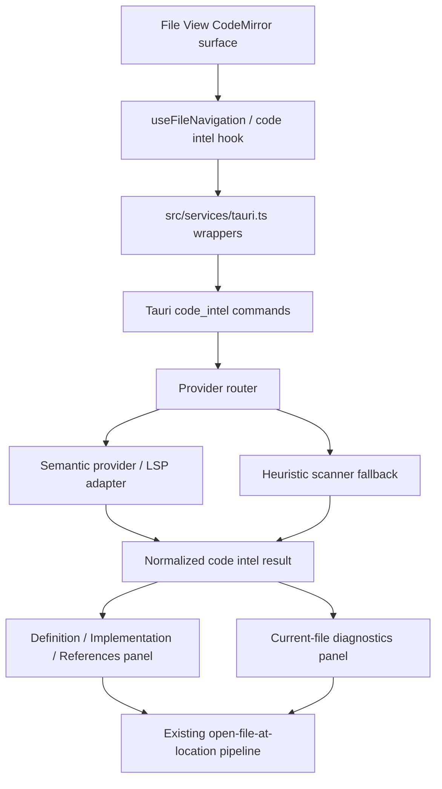
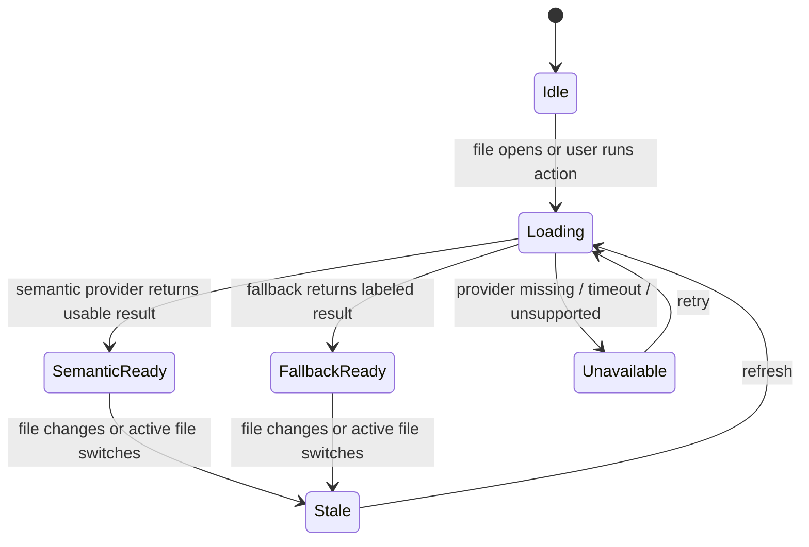

# Java Code Navigation Implementation Plan

## Summary

Extend the existing File View code intelligence surface for `Spring Boot / Maven` Java projects with semantic navigation, `Go to Implementation`, current-file diagnostics, and explicit provider/fallback status. This plan builds on the existing `file-view-code-intelligence-navigation` capability and current `FileViewPanel` / `useFileNavigation` / `code_intel_*` substrate rather than creating a parallel IDE.

---

## Problem Frame

The app already has a code viewer/editor, CodeMirror Java highlighting, definition/references controls, multi-tab file navigation, heuristic Rust `code_intel_*` commands, and OpenCode LSP debug wrappers. The gap is trust and depth for Java full-stack reading: a Spring developer needs to follow Controller -> Service -> Mapper/Repository paths and see current-file Java problems before making code judgments. A blank result must not mean the same thing as "semantic provider unavailable", and heuristic matches must not be presented as full Java semantic truth.

---

## Requirements

**Semantic Navigation**

- R1. Java files must support `Go to Definition`, preserving single-target direct navigation and multi-target explicit candidate selection.
- R2. Java files must support `Go to Implementation` for interfaces, abstract methods, superclass methods, and Spring-style injected types when the provider can resolve them.
- R3. Controller -> Service -> Mapper/Repository navigation must work through the existing file tab/location pipeline without losing open-file context.
- R4. `Find References` must remain available and should present results in a scan-friendly path/line/context shape.
- R5. Results must expose provider state: `semantic`, `fallback`, `unavailable`, or an equivalent user-visible classification.

**Diagnostics**

- R6. Opening a `.java` file must display a current-file diagnostics summary with error/warning/info counts when diagnostics are available.
- R7. Diagnostics must be clickable and navigate to the affected line/column.
- R8. Diagnostics must replace prior file results or mark stale/unavailable state; old-file errors must not appear as current-file evidence.
- R9. Maven/JDK/LSP/indexing/timeout failures must render as explicit unavailable or degraded states, not empty successful diagnostics.

**Spring Boot / Maven Fit**

- R10. The implementation must prioritize Spring Boot/Maven layouts, including `src/main/java`, `src/test/java`, and common multi-module source roots.
- R11. Spring dynamic behavior that cannot be resolved precisely must degrade honestly, especially proxies, mapper frameworks, annotation-driven wiring, and generated implementations.

**Non-Regression**

- R12. Existing file open/switch/close/save/search/annotation behavior must remain stable.
- R13. Non-Java files may keep current lightweight behavior; this plan must not imply equal semantic depth for every language.

---

## Key Technical Decisions

- **KTD1. Extend the existing code-intelligence capability.** The main spec already defines `file-view-code-intelligence-navigation`; this work should add diagnostics, implementation navigation, and provider-state semantics there instead of introducing a new capability namespace.
- **KTD2. Use provider routing, not a single hard dependency.** Backend code intelligence should route through a semantic provider when available and keep the current heuristic scanner as a labeled fallback. OpenCode LSP is a usable current adapter, but UI behavior should be expressed in provider-neutral terms.
- **KTD3. Normalize provider status before UI render.** Runtime payloads should become a typed frontend view model before reaching React components, so `semantic`, `fallback`, `unavailable`, timeout, and stale states are rendered consistently across definition, implementation, references, and diagnostics.
- **KTD4. Treat diagnostics as current-file evidence.** v1 diagnostics belong inside the file surface, not a global Problems tool window. The diagnostics lifecycle is file-scoped and request-guarded.
- **KTD5. Keep call hierarchy and Spring graphs out of v1.** LSP call hierarchy, Bean graph, endpoint graph, and JPA/entity visualization remain follow-up work because they add a second product surface beyond the confirmed code-reading path.

---

## High-Level Technical Design

The load-bearing contract is the normalized result between service/hook and UI. The provider router can evolve, but the file surface should consume stable status, locations, diagnostics, and freshness fields.

Diagnostics and navigation share the same stale-response discipline: late responses for a previous file or older request must not overwrite current file state.

---

## Implementation Units

### U1. OpenSpec change and spec delta

- **Goal:** Create behavior-spec artifacts for the Java navigation/diagnostics extension before implementation begins.
- **Requirements:** R1-R13
- **Dependencies:** None
- **Files:**
  - Create `openspec/changes/enhance-java-code-intelligence-navigation/proposal.md`
  - Create `openspec/changes/enhance-java-code-intelligence-navigation/design.md`
  - Create `openspec/changes/enhance-java-code-intelligence-navigation/tasks.md`
  - Create `openspec/changes/enhance-java-code-intelligence-navigation/specs/file-view-code-intelligence-navigation/spec.md`
  - May update `openspec/specs/file-view-code-intelligence-navigation/spec.md` after implementation sync/archive
- **Approach:** Extend the existing code-intelligence capability with Java implementation navigation, current-file diagnostics, provider-state labeling, and Spring/Maven degradation semantics. Do not create a new capability namespace.
- **Patterns to follow:**
  - `openspec/specs/file-view-code-intelligence-navigation/spec.md`
  - `openspec/changes/archive/2026-03-02-file-view-code-intelligence-navigation-2026-03-01/*`
- **Test scenarios:**
  - Test expectation: none -- this is behavior-spec scaffolding, validated through OpenSpec change validation during implementation.
- **Verification:** The change artifacts clearly map the brainstorm requirements into spec scenarios and do not duplicate existing main-spec requirements unnecessarily.

### U2. Normalized frontend code-intelligence contract

- **Goal:** Add a typed frontend normalization layer for navigation, implementation, references, diagnostics, provider status, stale state, and fallback labels.
- **Requirements:** R1, R2, R4, R5, R6, R8, R9, R12
- **Dependencies:** U1
- **Files:**
  - Modify `src/services/tauri.ts`
  - Modify `src/services/tauri.test.ts`
  - Modify `src/features/files/utils/fileViewNavigationUtils.ts`
  - Modify `src/features/files/utils/fileViewNavigationUtils.test.ts`
  - May create `src/features/files/utils/fileViewCodeIntelTypes.ts`
  - May create `src/features/files/utils/fileViewCodeIntelTypes.test.ts`
- **Approach:** Keep existing wrappers compatible while adding normalized result helpers that can parse `Location`, `LocationLink`, diagnostic arrays, provider status, source labels, stale metadata, and unavailable reasons. Extra backend fields should be additive so current callers do not break.
- **Execution note:** Add characterization coverage for the existing `extractLocations` and path/URI behavior before changing normalization.
- **Patterns to follow:**
  - `src/features/files/utils/fileViewNavigationUtils.ts`
  - `src/services/tauri.test.ts` mapping tests for `code_intel_*` and `opencode_lsp_*`
- **Test scenarios:**
  - Existing definition/references payloads still extract the same locations.
  - `LocationLink`-style payloads normalize to the same UI location shape as `Location`.
  - Diagnostic payloads normalize severity, message, code, source, range, and clickable start position.
  - Provider status values normalize into `semantic`, `fallback`, and `unavailable` view states.
  - Missing optional fields produce safe defaults instead of throwing in UI-facing helpers.
- **Verification:** Frontend service and utility tests prove backward compatibility and typed status/diagnostic normalization.

### U3. Backend provider router and Java capability expansion

- **Goal:** Extend backend code intelligence so Java definition/references can be supplemented by implementation and diagnostics requests with honest provider/fallback status.
- **Requirements:** R1, R2, R3, R5, R6, R8, R9, R10, R11
- **Dependencies:** U1, U2
- **Files:**
  - Modify `src-tauri/src/code_intel.rs`
  - Modify `src-tauri/src/engine/commands_opencode.rs`
  - Modify `src-tauri/src/command_registry.rs`
  - Test in existing Rust test modules or create a focused `src-tauri/src/code_intel_tests.rs` if the repo pattern allows
  - May modify `src-tauri/src/lib.rs` only if a new Rust test module requires registration
- **Approach:** Introduce provider routing behind the `code_intel` boundary. Semantic/LSP-backed responses should carry a semantic source label; heuristic scan responses should carry fallback labels. Add implementation lookup and current-file diagnostics as code-intelligence commands or command extensions. If the configured semantic provider lacks implementation or diagnostics support, return explicit unavailable/degraded status rather than pretending success.
- **Technical design:** Directionally, the provider router should select `semantic -> fallback -> unavailable` per capability, not per file globally. A provider can support diagnostics but not implementation, and UI must receive that distinction.
- **Patterns to follow:**
  - Current file safety and workspace-bound path handling in `src-tauri/src/code_intel.rs`
  - Existing OpenCode LSP wrappers in `src-tauri/src/engine/commands_opencode.rs`
  - Backend error handling guidance from `.trellis/spec/backend/error-handling.md`
- **Test scenarios:**
  - Java interface symbol returns implementation candidates from a semantic payload when the provider supplies them.
  - Heuristic Java fallback can find simple `implements Interface` or overriding method candidates and marks the result as fallback.
  - Unsupported or missing provider returns unavailable status with a bounded reason, not an empty successful result.
  - Diagnostics response maps provider diagnostics to file-scoped ranges and severities.
  - Path traversal and files outside workspace remain rejected.
  - Large files and skipped directories keep existing safety behavior.
- **Verification:** Rust unit coverage demonstrates provider status, fallback behavior, workspace safety, and diagnostics mapping without requiring a live Java project for every case.

### U4. File navigation hook orchestration

- **Goal:** Upgrade the file navigation hook so definition, implementation, references, diagnostics, loading, stale, timeout, and retry states are coordinated safely.
- **Requirements:** R1, R2, R4, R5, R6, R7, R8, R9, R12
- **Dependencies:** U2, U3
- **Files:**
  - Modify `src/features/files/hooks/useFileNavigation.ts`
  - Test via `src/features/files/components/FileViewPanel.test.tsx`
  - May create `src/features/files/hooks/useFileNavigation.test.tsx` if hook-level race coverage becomes cleaner there
- **Approach:** Preserve existing request id, debounce, cache, timeout, and navigation target patterns. Add implementation action and diagnostics loading to the same orchestration contract or split a focused `useFileDiagnostics` hook only if it reduces hook complexity. All runtime calls continue through `src/services/tauri.ts`.
- **Execution note:** Characterize current definition/references behavior first because the hook already handles stale responses and file-switch cleanup.
- **Patterns to follow:**
  - Hook guidelines for stale response guards and error normalization.
  - Current `useFileNavigation` request id and cache refs.
- **Test scenarios:**
  - Covers AE1. Definition still directly navigates for a single target and shows candidates for multiple targets.
  - Implementation action shows candidates rather than choosing an uncertain target.
  - Covers AE2. Diagnostics load on Java file open, replace prior file diagnostics, and click-through navigates to line/column.
  - Covers AE3. Timeout/provider unavailable state renders as unavailable/degraded, not "no results".
  - Fast file switch ignores the late diagnostics or navigation result from the previous file.
  - Retry clears stale error state and reuses the current file/path request identity.
- **Verification:** Component or hook tests prove no stale response can overwrite a newer file state and existing definition/references behavior is preserved.

### U5. File View UI for implementation and diagnostics

- **Goal:** Add visible controls and panels for `Go to Implementation`, diagnostics summary/list, provider status, fallback labels, retry, and close behavior inside the existing file surface.
- **Requirements:** R2, R5, R6, R7, R8, R9, R12
- **Dependencies:** U4
- **Files:**
  - Modify `src/features/files/components/FileViewPanel.tsx`
  - Modify `src/features/files/components/FileViewNavigationPanel.tsx`
  - Create `src/features/files/components/FileViewDiagnosticsPanel.tsx`
  - Test `src/features/files/components/FileViewPanel.test.tsx`
  - May create `src/features/files/components/FileViewDiagnosticsPanel.test.tsx`
  - Modify `src/styles/file-view-panel.css`
  - Modify `src/i18n/locales/en.part2.ts`
  - Modify `src/i18n/locales/zh.part2.ts`
- **Approach:** Keep code intelligence controls compact in edit mode and avoid a new global tool window. Provider status should be visible near the result/diagnostics panel and not dominate the toolbar. Diagnostics should have stable dimensions and should not push the editor into layout shifts during loading or stale transitions.
- **Patterns to follow:**
  - Existing `FileViewNavigationPanel` result list.
  - Existing lucide icon button usage in `FileViewPanel`.
  - Frontend component/i18n rules in `.trellis/spec/frontend/component-guidelines.md`.
- **Test scenarios:**
  - `Go to Implementation` button invokes the implementation action and renders candidates with source labels.
  - Diagnostics summary shows error/warning/info counts and provider status.
  - Clicking a diagnostic navigates to the expected line/column in the current file.
  - Fallback results display a fallback label; unavailable diagnostics display an actionable empty/degraded state.
  - Non-Java files do not show misleading Java diagnostics success state.
  - Existing edit/preview/save/find controls remain available.
- **Verification:** File View tests assert UI behavior and accessible names without relying on implementation details of the provider.

### U6. Spring Boot / Maven acceptance coverage

- **Goal:** Add representative Java fixtures and tests that exercise the confirmed Controller -> Service path, implementation lookup, diagnostics state, and honest degradation.
- **Requirements:** R2, R3, R6, R7, R9, R10, R11
- **Dependencies:** U3, U4, U5
- **Files:**
  - Modify or create Rust tests near `src-tauri/src/code_intel.rs`
  - Modify `src/features/files/components/FileViewPanel.test.tsx`
  - May add small inline Java fixture strings inside tests rather than large fixture files
  - May update `src/features/files/utils/fileViewNavigationUtils.test.ts`
- **Approach:** Use small source snippets for unit tests and avoid checking in a full Maven project fixture unless implementation proves it necessary. Cover Spring-like class/interface patterns in deterministic tests, and treat live Maven/JDK provider behavior as manual verification evidence under the OpenSpec change.
- **Patterns to follow:**
  - Existing `FileViewPanel.test.tsx` mocked service tests.
  - Rust code-intel safety limits for file size and directory skipping.
- **Test scenarios:**
  - Controller method call to `userService.createUser` navigates to the expected service/interface target.
  - Interface method implementation returns implementation candidates rather than only the interface declaration.
  - Mapper/Repository-style interface or generated behavior that cannot be resolved produces fallback/degraded state instead of a fake implementation.
  - Diagnostics list can show a provider error/unavailable state for a Maven/JDK problem.
  - Multi-module-like relative paths remain workspace-relative and navigable.
- **Verification:** Automated tests cover deterministic Spring-shaped fixtures; OpenSpec verification records any manual Java/Maven provider checks that require a local JDK/Maven workspace.

### U7. Governance, documentation, and final quality pass

- **Goal:** Keep behavior specs, implementation rules, and user-facing documentation aligned after the code work lands.
- **Requirements:** R1-R13
- **Dependencies:** U1-U6
- **Files:**
  - Modify `openspec/changes/enhance-java-code-intelligence-navigation/tasks.md`
  - Modify `openspec/changes/enhance-java-code-intelligence-navigation/design.md` if implementation discoveries change provider routing
  - Modify `.trellis/spec/frontend/index.md` only if a new reusable frontend rule is learned
  - May modify `.trellis/spec/frontend/*` or `.trellis/spec/backend/*` only for durable implementation rules
  - May modify user-facing docs under `src/features/client-documentation/clientDocumentationData.ts` if the product docs surface should mention Java diagnostics/navigation
- **Approach:** Capture implementation discoveries where they belong. Behavior truth goes into the OpenSpec change; durable code-level lessons go into Trellis specs only when they generalize beyond this feature.
- **Test scenarios:**
  - Test expectation: none -- documentation/governance update; validation is spec consistency and review.
- **Verification:** OpenSpec change status reflects completed tasks, main spec deltas are ready for sync/archive, and no docs imply full IDE parity.

---

## Acceptance Examples

- AE1. Controller method call jumps to Service
  - **Given:** A Spring Boot Maven workspace is open and the cursor is on `userService.createUser` in a Controller.
  - **When:** The user runs `Go to Definition`.
  - **Then:** The target Service/interface/implementation is opened at the relevant method location, or multiple candidates are shown for explicit selection.
  - **Covered by:** U3, U4, U5, U6

- AE2. Java diagnostics are visible and actionable
  - **Given:** A `.java` file has current-file diagnostics from the semantic provider.
  - **When:** The file opens.
  - **Then:** The file surface shows diagnostic counts, lets the user click a diagnostic, and clears/replaces diagnostics on file switch.
  - **Covered by:** U2, U3, U4, U5

- AE3. LSP unavailable is not silent
  - **Given:** Maven/JDK/LSP/provider state is unavailable, indexing, timed out, or unsupported.
  - **When:** The user runs navigation or diagnostics.
  - **Then:** The UI shows unavailable/degraded state and fallback labels instead of presenting an empty success.
  - **Covered by:** U2, U3, U4, U5, U6

---

## System-Wide Impact

- **Frontend File View:** Adds implementation navigation, diagnostics panel state, provider/fallback status labels, and i18n copy inside the existing file surface.
- **Frontend service boundary:** Extends `src/services/tauri.ts` mapping and typed normalization for code-intelligence responses.
- **Rust backend:** Extends the code intelligence command boundary and may add provider routing across existing heuristic and LSP-backed adapters.
- **OpenSpec:** Extends the existing `file-view-code-intelligence-navigation` capability.
- **Performance:** First-use semantic provider calls may be slow in large Maven workspaces; request guards, timeouts, and stale result handling are required.
- **Privacy/security:** Diagnostics and navigation payloads should contain paths, ranges, messages, and bounded context only; no source-file bulk dumps or environment secrets should be added to diagnostics.

---

## Risks And Dependencies

- **Semantic provider availability:** OpenCode LSP commands may vary by installed version or provider setup. Mitigation: provider-neutral command contract, capability-specific unavailable states, and heuristic fallback labels.
- **Heuristic fallback precision:** Regex/scanner fallback cannot fully understand Spring proxies, generated mapper implementations, or dynamic Bean wiring. Mitigation: label fallback and avoid fake certainty.
- **Large Maven workspace latency:** Diagnostics and references can be expensive. Mitigation: current-file diagnostics for v1, request timeout, cache/retry behavior, and no global Problems scope.
- **UI trust:** Empty state, unavailable state, stale state, and fallback state are easy to conflate. Mitigation: normalize status before rendering and cover state-specific tests.
- **Existing File View regressions:** `FileViewPanel` is already feature-rich. Mitigation: targeted characterization tests and small extracted components for diagnostics/status UI.

---

## Deferred Implementation Notes

- Exact semantic provider availability must be verified during implementation against the installed OpenCode/LSP command shape. The plan requires a stable provider-neutral contract, not a commitment that every host already has Java semantic support.
- The implementation should prefer small inline Java fixtures for deterministic tests; a full Maven fixture should only be added if provider integration cannot be validated otherwise.
- If implementation discovers that diagnostics and navigation need separate provider lifecycles, split the frontend hook only at that point. The plan does not require one hook to own every state if that makes stale-response handling harder.

---

## Scope Boundaries

### Deferred To Follow-Up Work

- Project-wide Problems tool window.
- Call hierarchy, incoming calls, outgoing calls, and usage clustering.
- Spring Bean graph, endpoint graph, JPA/entity graph, or generated mapper graph visualization.
- Java quick fixes, code actions, rename/refactor, organize imports, and safe delete.
- Debugger, breakpoints, Maven lifecycle panel, and test runner integration.

### Outside This Product's V1 Identity

- Replacing the current workbench with a full IntelliJ IDEA or VS Code clone.
- Promising equal semantic depth for every language.
- Presenting fallback scanner results as complete Java semantic truth.

---

## Sources And Research

- Origin requirements: `docs/brainstorms/2026-06-09-java-code-navigation-requirements.md`.
- Current capability: `openspec/specs/file-view-code-intelligence-navigation/spec.md`.
- Prior implementation artifacts: `openspec/changes/archive/2026-03-02-file-view-code-intelligence-navigation-2026-03-01/*`.
- Existing frontend surface: `src/features/files/components/FileViewPanel.tsx`, `src/features/files/hooks/useFileNavigation.ts`, `src/features/files/components/FileViewNavigationPanel.tsx`.
- Existing frontend tests: `src/features/files/components/FileViewPanel.test.tsx`, `src/features/files/utils/fileViewNavigationUtils.test.ts`, `src/services/tauri.test.ts`.
- Existing backend commands: `src-tauri/src/code_intel.rs`, `src-tauri/src/engine/commands_opencode.rs`, `src-tauri/src/command_registry.rs`.
- Project rules: `.trellis/spec/frontend/index.md`, `.trellis/spec/backend/index.md`, `.trellis/spec/guides/cross-layer-thinking-guide.md`, `.trellis/spec/frontend/hook-guidelines.md`.
- IntelliJ IDEA 2026.1 docs: source navigation includes go to declaration, implementation navigation, and issue navigation; Find Usages supports project-wide references and grouped/previewed results. Reference: https://www.jetbrains.com/help/idea/navigating-through-the-source-code.html and https://www.jetbrains.com/help/idea/find-highlight-usages.html.
- LSP 3.17 docs: definition, implementation, references, publish diagnostics, and pull diagnostics are separate capabilities; diagnostics replacement semantics require newly pushed diagnostics to replace prior ones rather than merge on the client. Reference: https://microsoft.github.io/language-server-protocol/specifications/lsp/3.17/specification/.
- CodeMirror docs and local dependency state: CodeMirror provides the editor extension surface, while `@codemirror/lang-java` covers Java syntax support; semantic features require a provider beyond syntax highlighting. Reference: https://codemirror.net/.
