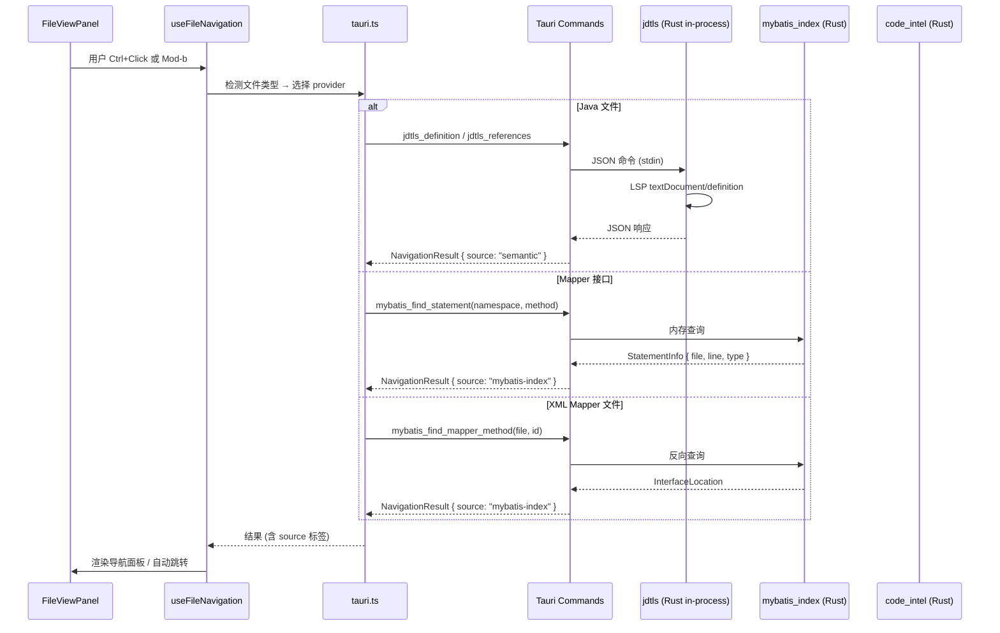
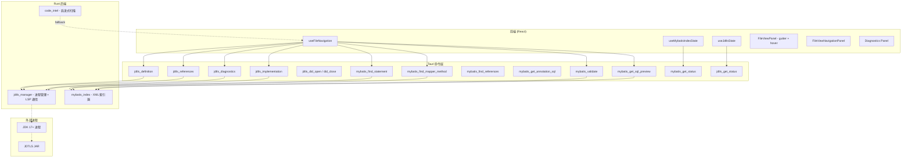

# feat: MyBatis Mapper + Java IDE-Level Navigation

为 ccgui 构建 IDEA 级代码导航能力：通用 Java 语义导航由 JDTLS（Eclipse JDT Language Server）提供，MyBatis Mapper 专属导航由 Rust 后端原生索引器提供，前端在现有 File View 上扩展 gutter 图标、hover 预览、结果面板和诊断界面。

---

## Problem Frame

Java 全栈开发者阅读 Spring Boot + MyBatis 项目时，最高频的操作是沿着调用链跨文件跳转：从 Controller 追到 Service，从 Service 追到 Mapper 接口，再从 Mapper 接口跳到 XML SQL 定义。当前 ccgui 已有 CodeMirror Java 高亮、基础 definition/references 按钮和 `code_intel.rs` 启发式扫描，但存在三个核心缺口：

1. **没有 MyBatis 感知**：系统不知道 Mapper 接口和 XML 之间的 namespace + id 对应关系
2. **Java 语义深度不足**：启发式扫描无法理解接口-实现关系、继承链、方法重写等 Java 类型系统特征
3. **没有诊断能力**：用户无法在打开文件时看到编译错误、Mapper 配置不一致等问题

错误的跳转结果比没有跳转更危险——它会让用户误判代码关系。需要一个准确、可降级、有诊断能力的导航系统。

---

## Key Technical Decisions

1. **JDTLS in-process 模块 + 持久化会话。** 在 `src-tauri/src/jdtls/` 下构建 JDTLS 管理模块（in-process 模式）：`JdtlsManager` 结构体通过 `tokio::process::Command` 直接启动 JDTLS Java 子进程，在 Tauri 应用进程内管理 stdin/stdout 管道，维持持久 stdio JSON-RPC 连接。这与现有 `opencode_lsp_*` 的 fire-and-forget 模式不同（后者每次请求 spawn 新进程），JDTLS 需要持久会话以支持 `textDocument/didOpen` 同步、诊断推送和 keep-alive。（see origin: Key Decisions 第一条）

2. **MyBatis 导航独立于 JDTLS。** Rust 后端构建原生 MyBatis XML 索引器（使用 `quick-xml`，已是传递依赖），namespace + id 匹配是确定性的，不依赖 JDK。即使 JDTLS 不可用，Mapper ↔ XML 跳转和 SQL 预览仍正常工作。（see origin: Key Decisions 第二条）

3. **JDK 17+ 运行时要求。** JDTLS 本身需要 JDK 17+ 来运行。当 JDK 17+ 不可用时，Java 语义导航降级到启发式扫描（现有 `code_intel.rs`），MyBatis 导航不受影响。（see origin: Dependencies D4, R25）

4. **Provider 状态透明。** 每个导航请求标注来源（`semantic` / `mybatis-index` / `heuristic`），前端通过状态标签展示各 provider 就绪状态，用户能区分语义结果和启发式结果。（see origin: Key Decisions 第五条, R6, R22）

5. **test-first 开发策略。** 进程管理、LSP 协议通信和 UI 集成均为高风险区域，每个 implementation unit 先写测试再实现。（see origin: R23-R26 reliability requirements）

---

## High-Level Technical Design





---

## Requirements

**Java Language Navigation (JDTLS)**

- R1. 打开 Java 文件并聚焦代码后，用户 SHALL 能从光标所在 symbol 执行 Go to Definition，结果唯一时直接跳转，多结果时展示候选列表。候选 MUST 包含文件路径、行号和 symbol 上下文。
- R2. 用户 SHALL 能从接口方法、抽象方法或父类方法执行 Go to Implementation，查看所有实现类/方法候选。候选 MUST 包含文件路径、行号和实现类名。
- R3. 用户 SHALL 能执行 Find Usages 查看项目范围内 symbol 的所有使用位置；结果 MUST 按 Java references 和 MyBatis references 分组展示，每条结果包含文件路径、行列和代码上下文。
- R4. 用户 SHALL 能通过 Go to Super Method 从 override 方法导航到父类/接口中的声明方法。
- R5. 用户 SHALL 能从字段声明跳转到字段类型的定义位置（Go to Type）。
- R6. JDTLS 提供的导航结果 MUST 标记为 `semantic` 来源，与 MyBatis 索引器和启发式 fallback 结果明确区分。

**MyBatis Mapper Navigation**

- R7. 用户 SHALL 能从 Mapper 接口方法跳转到对应的 XML `<select>/<insert>/<update>/<delete>` 语句（Go to XML Statement）；匹配规则为 namespace（接口全限定名）+ method name = XML statement id。
- R8. 用户 SHALL 能从 XML statement 的 `id` 属性跳转回 Mapper 接口方法（Go to Mapper Method）；这是 R7 的反向导航。
- R9. 当 Mapper 接口方法使用 `@Select`/`@Insert`/`@Update`/`@Delete` 注解定义 SQL 时，用户 SHALL 能 hover 查看完整 SQL 内容，不需要跳转到其他文件。
- R10. 当 SQL 定义在 XML 中时，用户 SHALL 能通过 hover 预览查看该方法对应的 SQL 内容（包含 SQL 类型标签：SELECT/INSERT/UPDATE/DELETE）。
- R11. 用户 SHALL 能从 `<select>` 等标签的 `resultMap` 属性跳转到对应的 `<resultMap>` 定义（ResultMap 导航）。
- R12. 对于 MyBatis-Plus `BaseMapper<T>` 的内置 CRUD 方法，v1 SHALL 在 hover 中对已知 BaseMapper 签名（selectById、insert、updateById 等）显示静态提示"由 MyBatis-Plus 动态生成"；泛型 T 解析和 SQL 概要生成 deferred to v2（见 Scope Boundaries）。
- R13. Mapper ↔ XML 导航 MUST 独立于 JDTLS 工作。即使 JDK 不可用或 JDTLS 未就绪，Mapper ↔ XML 跳转和 SQL 预览 SHOULD 正常工作。

**Diagnostics and Validation**

- R14. JDTLS 提供的 Java 诊断 SHALL 在文件打开时自动加载，并以内联标记和诊断面板形式展示。诊断 MUST 支持点击跳转到对应行列。
- R15. 系统 SHALL 对 Mapper 接口与 XML 的一致性执行校验：接口中声明的方法在 XML 中无对应 statement id → 警告；XML 中的 statement id 在接口中无对应方法 → 警告；XML namespace 与接口全限定名不匹配 → 错误；同一 namespace 下存在重复 statement id → 错误。
- R16. 诊断结果 MUST 在切换文件时正确清理，旧文件的诊断不能残留在新打开文件上。
- R17. 当诊断数据不可用时，系统 SHALL 展示明确的不可用状态，而不是空白诊断列表。

**UI and Usability**

- R18. 编辑器 gutter SHALL 根据当前文件类型和光标位置显示导航图标：Mapper 接口方法旁显示 MyBatis 叶子图标；XML statement 旁显示 Java 类图标；override 方法旁显示向上箭头；有实现类时显示向下箭头。
- R19. 鼠标 hover 在 Mapper 方法名、XML statement id、Java symbol 上时，SHALL 显示预览 tooltip，内容包含 symbol 类型、定义位置和简短上下文。
- R20. File View SHALL 提供导航结果面板，展示 Find Usages 和 Go to Implementation 的候选列表。面板 MUST 支持：按类型分组、点击跳转、关闭面板、重新执行查询。
- R21. 快捷键 SHOULD 接近 IDEA 用户习惯：Ctrl/Cmd+Click 跳转定义、Ctrl/Cmd+B 跳转定义、Ctrl/Cmd+Alt+B 跳转实现、Ctrl/Cmd+Alt+F7 查找引用、Ctrl+U 跳到 super method。
- R22. 导航按钮旁 SHALL 显示 provider 状态标签：JDTLS（绿色=就绪、黄色=索引中、红色=不可用）、MyBatis（绿色=就绪、灰色=降级）、Fallback（灰色=仅启发式结果）。

**Reliability**

- R23. 所有语义请求 MUST 有 request id guard 和超时机制，避免旧请求覆盖新文件结果。超时后 SHOULD 提供重试入口。
- R24. JDTLS 首次索引期间，系统 SHALL 在 UI 上展示"正在索引"状态，在此期间 Java 导航 SHOULD 降级到启发式结果。
- R25. 当 JDK 17+ 不可用时，系统 SHALL 明确告知用户 Java 语义导航不可用及解决方式，MyBatis Mapper 导航 SHOULD 不受影响。
- R26. 当 Maven/Gradle 项目配置异常时，JDTLS 诊断 MUST 说明具体原因。

---

## Scope Boundaries

**Deferred for later**

- 调用层级 call hierarchy / incoming calls / outgoing calls
- Java rename / refactor / organize imports / quick fix code actions
- Spring Bean 依赖图、endpoint 图、JPA entity 图的可视化
- 全项目 Problems 工具窗口和批量 inspection 报告
- Debugger、断点、运行测试、Maven lifecycle 面板
- Java 代码补全（completion）——JDTLS 支持但 v1 不优先做
- 多模块 Maven/Gradle 项目的跨模块导航——v1 先覆盖单模块
- MyBatis-Plus `BaseMapper<T>` 泛型类型解析和 SQL 概要生成（R12）——v1 仅在 U4 hover 中对已知 BaseMapper 签名显示静态提示"由 MyBatis-Plus 动态生成"，不做泛型 T 解析

**Outside v1 identity**

- 复刻 IntelliJ IDEA 或 VS Code 的完整 IDE
- 把当前产品主界面替换成独立代码编辑器
- 对所有语言承诺同等深度的 semantic navigation

---

## Implementation Units

### U1. JDTLS 进程管理与 LSP 通信基础设施

**Goal:** 在 Rust 后端构建 JDTLS 进程管理器和最小 LSP 客户端，提供持久化 JDTLS 会话管理、JSON-RPC stdio 通信、以及 Tauri 命令层暴露的 Java 语义导航接口。

**Requirements:** R1, R2, R4, R5, R6, R14, R24, R25, R26

**Dependencies:** 无（首个 implementation unit）

**Files:**
- `src-tauri/src/jdtls/manager.rs` — JDTLS 进程生命周期管理
- `src-tauri/src/jdtls/lsp_client.rs` — JSON-RPC stdio 通信层
- `src-tauri/src/jdtls/types.rs` — LSP 协议类型映射
- `src-tauri/src/jdtls/commands.rs` — Tauri 命令层（jdtls_definition, jdtls_references 等）
- `src-tauri/src/jdtls/mod.rs` — 模块入口
- `src-tauri/src/jdtls/manager_test.rs` — 进程管理器测试
- `src-tauri/src/jdtls/lsp_client_test.rs` — LSP 客户端测试

**Approach:**

在 `src-tauri/src/jdtls/` 下构建 JDTLS 管理模块（in-process 模式），通过 `tokio::process::Command` 直接启动 JDTLS Java 子进程，在 Tauri 应用进程内维持持久 stdio JSON-RPC 连接。

核心架构：
- `JdtlsManager` 结构体持有 `tokio::process::Child` 句柄，管理 stdin/stdout 管道
- `LspClient` 负责 Content-Length 帧化的 JSON-RPC 读写，请求 ID 自增，通过 `oneshot` 通道匹配响应
- 进程按需启动（首次 Java 文件请求时），复用 `-data` 目录缓存索引
- 健康检查：定期 ping（$/ping 或空请求），进程退出时自动重启

**初始化时序：** spawn JDTLS 进程 → 等待 stdout 就绪 → 发送 `initialize` 请求（含 capabilities）→ 解析响应 → 发送 `initialized` 通知 → 发送 `textDocument/didChangeConfiguration`（传递项目 Java 版本和 rootUri）→ 进入 ready 状态。所有导航请求和 didOpen 通知在此流程完成前排队等待，避免在 JDTLS 就绪前发送请求导致静默失败。

**空闲关闭：** 追踪最近一次 Java 文件请求时间戳。若超过 30 分钟未使用，先对所有 tracked open files 发送 `textDocument/didClose`（确保 JdtlsManager 与 JDTLS 状态一致），再发送 `shutdown` + `exit` JSON-RPC 优雅关闭 JDTLS 进程，释放 `-data` 目录锁。下次 Java 文件请求时重新启动。

**僵尸进程防护：** JDTLS 子进程通过 `pre_exec` 调用 `setsid()` 创建独立进程组，Tauri 应用退出时 SIGTERM 整个进程组。可选在 `-data` 目录写入 PID 文件，启动时检测并清理残留进程。

**文件同步（textDocument sync）：** JDTLS 需要知道哪些文件是打开的才能提供准确的诊断和导航。LspClient 必须实现以下生命周期：
- 前端打开 Java 文件时发送 `textDocument/didOpen`（包含文件 URI 和内容）
- 文件内容变更时发送 `textDocument/didChange`（使用 incremental sync，避免大文件全量传输的性能问题）
- 文件关闭或切换时发送 `textDocument/didClose`
- 这些操作通过新增的 Tauri 命令暴露：`jdtls_did_open`、`jdtls_did_change`、`jdtls_did_close`

**项目根检测：** 从打开文件的目录向上遍历查找 `pom.xml`、`build.gradle` 或 `build.gradle.kts`，用第一个找到的作为 JDTLS 的 `rootUri`。未找到则 fallback 到 workspace root。`-data` 目录的 `project-hash` 由 `rootUri` 的 hash 派生，避免多项目索引冲突。

JDTLS 启动命令模式：
```
java -Declipse.application=org.eclipse.jdt.ls.core.id1
     -Dosgi.bundles.defaultStartLevel=4
     -Declipse.product=org.eclipse.jdt.ls.core.product
     -jar <jdtls-installation>/plugins/org.eclipse.equinox.launcher_*.jar
     -configuration <jdtls-installation>/config_<os>
     -data <app-cache-dir>/jdtls/<project-hash>
     -Xmx1G
```

JDK 探测顺序：`jdtls.java.home` 设置 → `JAVA_HOME` 环境变量 → PATH 上的 `java`。找到 java 后执行 `java -version` 确认版本 >= 17，若不符合则继续扫描 PATH 上的其他 java binary，并在 `jdtls_get_status` 中报告具体版本和所需版本。

Tauri 命令层暴露：`jdtls_definition`、`jdtls_references`、`jdtls_implementation`、`jdtls_diagnostics`、`jdtls_did_open`、`jdtls_did_change`、`jdtls_did_close`、`jdtls_get_status`。

**Patterns to follow:**
- 进程 spawn 参考 `src-tauri/src/engine/commands_opencode.rs` 中的 `build_opencode_command()` 模式（仅复用 subprocess spawn 部分，不复用 fire-and-forget 模式）
- Tauri 命令注册参考 `src-tauri/src/command_registry.rs` 的现有命令注册模式
- 异步 I/O 使用 `tokio::io::{AsyncBufReadExt, AsyncWriteExt}`

**Test scenarios:**
- Happy path: 启动 JDTLS 进程，发送 `initialize` 请求，收到 capabilities 响应
- Happy path: 已初始化状态下发送 `textDocument/definition` 请求，收到位置结果
- Edge case: JDK 未安装时，`jdtls_get_status` 返回 `unavailable` 状态和安装提示
- Edge case: JDTLS 进程意外退出后，下次请求自动重启进程并重新初始化
- Error path: 请求超时（8s），返回超时错误而非挂起
- Error path: 旧请求在新文件打开后未完成，request id guard 正确取消旧结果
- Integration: JDTLS 索引期间返回 `indexing` 状态，前端可据此降级到启发式。最大索引时间 120s，超时后 `jdtls_get_status` 报告警告并提供用户选项：继续等待 / 重启 JDTLS / 仅使用启发式

**Verification:**
- 在有 JDK 17+ 的机器上启动 JDTLS，能成功完成 `initialize` 握手
- 对一个简单的 Spring Boot 项目，`jdtls_definition` 能正确跳转方法调用
- 进程崩溃后自动恢复，不影响后续请求

---

### U2. MyBatis XML 索引器

**Goal:** 构建 Rust 原生 MyBatis Mapper XML 索引器，解析 mapper XML 文件，建立 namespace + id 的双向映射，提供 Mapper ↔ XML 导航和 SQL 预览查询接口。

**Requirements:** R7, R8, R9, R10, R11, R13, R15

**Dependencies:** 无（独立于 U1）

**Files:**
- `src-tauri/src/mybatis_index/mod.rs` — 模块入口与公共接口
- `src-tauri/src/mybatis_index/parser.rs` — MyBatis XML 解析器
- `src-tauri/src/mybatis_index/index.rs` — 内存索引与查询
- `src-tauri/src/mybatis_index/types.rs` — 数据类型定义
- `src-tauri/src/mybatis_index/commands.rs` — Tauri 命令层
- `src-tauri/src/mybatis_index/parser_test.rs` — XML 解析器测试
- `src-tauri/src/mybatis_index/index_test.rs` — 索引查询测试
- `src-tauri/src/mybatis_index/commands_test.rs` — Tauri 命令测试

**Approach:**

使用 `quick-xml`（已是传递依赖）解析 MyBatis mapper XML：
1. 提取 `<mapper namespace="...">` 根元素的 namespace 属性
2. 提取每个 `<select>/<insert>/<update>/<delete>` 元素的 `id` 属性和 SQL 文本内容
3. 提取 `<resultMap id="...">` 定义用于 ResultMap 导航
4. 解析 `<sql id="...">` fragment 定义，建立 fragment 索引（namespace+id → fragment 内容）。生成 SQL 预览时解析 `<include refid="...">` 引用，替换为实际 fragment 内容。v1 限制：跨 namespace 的 `<include>` 保留未解析状态
5. 建立双向索引：`namespace+id → file+line`（正向）和 `file+id → namespace+method`（反向）

**注解 SQL 解析（R9）：** 对 Mapper 接口 Java 文件，使用 regex 提取 `@Select`/`@Insert`/`@Update`/`@Delete` 注解中的 SQL 字符串。覆盖范围：(a) `@Select("SELECT ...")` 单字符串字面量；(b) `@Select({"SELECT ...", "..."})` 数组形式。不覆盖：字符串拼接 `+`、Java text blocks `"""`、`List<String>` 参数。提取失败时返回 `{sql: null, status: 'unsupported_pattern'}`，前端 hover 显示"注解格式不支持，跳转查看源码"。建立 `namespace+method → annotation_sql` 映射，用于 hover 预览。此功能独立于 JDTLS，符合 R13 独立性要求。

**注解索引触发：** XML 索引完成后，根据已解析的 namespace 列表扫描对应的 Java Mapper 文件，提取注解 SQL。Java 文件发现复用反向导航中的 `ignore::WalkBuilder` 搜索。增量更新通过文件 watcher 监听 Java 文件变化触发。

**反向导航（R8）：** 从 XML statement id 定位到 Java 接口方法时：
1. 将 namespace（如 `com.example.mapper.UserMapper`）转换为预期文件路径 `com/example/mapper/UserMapper.java`；内部类 namespace 中的 `$` 转换为路径分隔符或使用 glob fallback `*Mapper*.java`
2. 在项目所有 `src/**/java` 目录中搜索该文件（复用 `ignore::WalkBuilder`），多匹配时返回 ambiguous 状态
3. 在找到的 Java 文件中定位方法声明（regex 匹配方法签名，至少区分参数数量以处理重载方法）
4. 如果 Java 文件不存在或方法定位失败，返回 namespace 对应的预期路径作为提示

文件发现策略：
1. 读取 `application.yml`/`application.properties` 中的 `mybatis.mapper-locations`（使用 `serde_yml` 解析 YAML 值，非复用 `code_intel.rs` 的结构导航能力；需作为新直接依赖添加到 Cargo.toml）
2. 回退到约定路径：`**/src/main/resources/mapper/**/*.xml`、`**/src/main/resources/mybatis/**/*.xml`
3. 最终回退：扫描所有 `**/*Mapper.xml` 文件

数据模型：
- `MapperStatement { namespace, id, statement_type, file_path, line, column, sql_content }`
- `MapperIndex { statements: HashMap<String, Vec<MapperStatement>>, file_map: HashMap<String, Vec<MapperStatement>>, annotation_map: HashMap<String, String>, sql_fragments: HashMap<String, String> }`

ResultMap 导航：解析 `<resultMap>` 的 `id` 属性，建立 statement `resultMap` 属性值 → `<resultMap>` 位置的映射。

文件解析状态追踪：记录每个 XML 文件的解析状态（成功/失败+错误信息），在 `mybatis_get_status` 中暴露解析失败计数。`mybatis_validate` 发现 missing statement 时交叉检查解析失败的文件，避免误报。

Tauri 命令暴露：`mybatis_find_statement`、`mybatis_find_mapper_method`、`mybatis_find_references`、`mybatis_get_sql_preview`、`mybatis_get_annotation_sql`、`mybatis_validate`、`mybatis_get_status`。

**Patterns to follow:**
- 使用 `quick-xml` 的事件驱动解析（参考 `quick-xml` crate 文档的 Reader API；需作为新直接依赖添加到 Cargo.toml，版本 0.38 对齐 Cargo.lock 中已有的传递依赖）
- XML 文件发现使用 `ignore::WalkBuilder`（已在 `code_intel.rs` 中使用）
- 增量更新：文件 watcher（`notify` crate，已是依赖）监听 XML 变化，触发索引重建

**Test scenarios:**
- Happy path: 解析标准 mapper XML，正确提取 namespace、所有 statement id、SQL 内容
- Happy path: 正向查询——给定 namespace + method name，返回正确的 XML statement 位置
- Happy path: 反向查询——给定 XML 文件路径 + statement id，返回对应的 Java 接口方法位置（通过 namespace→路径转换+Java 文件搜索）
- Happy path: 注解 SQL 提取——从 Java Mapper 文件中提取 `@Select("SELECT * FROM user")` 注解内容
- Happy path: 注解 SQL 数组形式——提取 `@Select({"SELECT ...", "..."})` 拼接后的内容
- Edge case: 注解 SQL 使用字符串拼接 `+` 或 text blocks `"""`——regex 提取失败，返回 unsupported_pattern 状态
- Happy path: SQL fragment 解析——`<include refid="...">` 被正确替换为 fragment 内容
- Happy path: `mybatis_find_references` 返回同 namespace 下的所有 statement 引用
- Edge case: XML 中包含 CDATA 段（`<![CDATA[...]]>`），SQL 内容正确提取
- Edge case: resultMap 交叉引用（statement 引用 resultMap，resultMap extends 另一个 resultMap）
- Edge case: 跨 namespace 的 `<include>` 引用，保留未解析状态
- Error path: XML 格式错误时返回解析错误而非 panic，记录到文件解析状态
- Integration: `mybatis_validate` 检测到缺失的 XML statement 时返回正确的警告信息
- Integration: `mybatis_validate` 检测到 namespace 不匹配时返回错误
- Integration: `mybatis_validate` 不会对解析失败的 XML 文件中的 method 误报 missing statement

**Verification:**
- 对一个包含 3 个 Mapper XML + 3 个 Mapper 接口的示例项目，索引正确建立双向映射
- SQL 预览返回完整 SQL 文本（含 CDATA）
- 校验能发现缺失 statement、重复 id、namespace 不匹配三类问题

---

### U3. 前端导航服务层集成与 Provider 编排

**Goal:** 更新前端服务层，扩展 `useFileNavigation` hook 以支持多 provider 编排（JDTLS semantic、MyBatis index、heuristic fallback），实现 provider 状态管理和结果源标注。

**Requirements:** R3, R6, R13, R16, R17, R22, R23, R24, R25

**Dependencies:** U1, U2

**Files:**
- `src/services/tauri.ts` — 新增 Tauri 命令类型定义和调用函数
- `src/features/files/hooks/useFileNavigation.ts` — 扩展多 provider 编排逻辑
- `src/features/files/hooks/useJdtlsState.ts` — JDTLS provider 状态管理 hook（新建）
- `src/features/files/hooks/useMybatisIndexState.ts` — MyBatis provider 状态管理 hook（新建）
- `src/features/files/hooks/useFileNavigation.test.ts` — 导航 hook 集成测试（新建）
- `src/services/tauri.test.ts` — 扩展现有 tauri service 测试

**Approach:**

1. **服务层扩展：** 在 `src/services/tauri.ts` 中新增 Tauri 命令调用函数：
   - `getJdtlsDefinition`、`getJdtlsReferences`、`getJdtlsImplementation`、`getJdtlsDiagnostics`、`getJdtlsDidOpen`、`getJdtlsDidChange`、`getJdtlsDidClose`、`getJdtlsStatus`
   - `getMybatisFindStatement`、`getMybatisFindMapperMethod`、`getMybatisFindReferences`、`getMybatisSqlPreview`、`getMybatisAnnotationSql`、`getMybatisValidate`、`getMybatisStatus`
   - 统一返回类型 `NavigationResult { locations, source: "semantic" | "mybatis-index" | "heuristic" }`

2. **Provider 编排（useFileNavigation 扩展）：**
   - 检测当前文件类型（Java / XML mapper / 其他）
   - Java 文件：优先 JDTLS → fallback 到 heuristic (`code_intel_definition`)
   - Mapper 接口（检测到 `@Mapper` 注解或在 mapper-locations 路径下）：优先 MyBatis index → fallback 到 JDTLS → heuristic
   - XML mapper 文件：MyBatis index 反向查询
   - 每个结果标注 `source` 字段供 UI 区分

3. **Provider 状态管理：**
   - `useJdtlsState`：跟踪 JDTLS 状态（`starting` / `indexing` / `ready` / `unavailable`），轮询 `jdtls_get_status`
   - `useMybatisIndexState`：跟踪 MyBatis 索引状态（`building` / `ready` / `error`），轮询 `mybatis_get_status`
   - 两个 hook 在 FileViewPanel 挂载时初始化，卸载时清理

4. **Find Usages 结果合并：**
   - 对 Find Usages 请求，并行调用 JDTLS references + `mybatis_find_references`
   - 合并结果按 `source` 分组：Java References（semantic + heuristic）和 MyBatis References（mybatis-index）
   - request id guard 确保旧请求不覆盖新文件结果（R23）

**Patterns to follow:**
- 现有 `useFileNavigation` 的 request guard 和 cache 逻辑（120ms debounce, 3s TTL cache, 8s timeout）保持不变
- Provider 状态管理参考 `useFileExternalSync` 的轮询模式
- 空结果处理参考现有 `FileViewNavigationPanel.tsx` 的错误展示

**Test scenarios:**
- Happy path: Java 文件上执行 Go to Definition，JDTLS 返回结果时 source 标记为 `semantic`
- Happy path: Mapper 接口方法上执行 Go to Definition，MyBatis index 返回 XML 位置
- Happy path: Find Usages 同时返回 Java 和 MyBatis 结果，正确分组
- Edge case: JDTLS 不可用时，Java 导航降级到 heuristic，状态标签显示红色
- Edge case: JDTLS 索引中，导航仍可用但结果可能不完整，状态标签显示黄色
- Edge case: 切换文件后旧请求的响应到达，不更新新文件的导航结果
- Error path: JDTLS 请求超时（8s），返回超时提示并提供重试按钮

**Verification:**
- 在有 JDK 的环境下打开 Java 文件，导航结果 source 为 `semantic`
- 无 JDK 环境下打开 Java 文件，导航降级到 heuristic，状态标签正确显示
- 切换文件时旧诊断和旧导航结果被正确清理

---

### U4. 导航 UI 组件（Gutter、Hover、导航面板）

**Goal:** 在 CodeMirror 编辑器上实现 gutter 导航图标、hover 预览 tooltip、provider 状态标签，以及增强的导航结果面板（支持分组展示）。

**Requirements:** R18, R19, R20, R21, R22, R12

**Dependencies:** U3

**Files:**
- `src/features/files/components/FileViewPanel.tsx` — 扩展 gutter 图标和状态标签
- `src/features/files/components/FileViewBody.tsx` — 添加 CodeMirror hover 扩展
- `src/features/files/components/FileViewNavigationPanel.tsx` — 增强导航面板（分组展示）
- `src/features/files/components/ProviderStatusBadge.tsx` — provider 状态标签组件（新建）
- `src/features/files/utils/gutterExtensions.ts` — CodeMirror gutter 扩展工具（新建）
- `src/features/files/utils/hoverExtensions.ts` — CodeMirror hover 扩展工具（新建）
- `src/features/files/components/FileViewPanel.test.tsx` — 扩展现有组件测试
- `src/features/files/components/ProviderStatusBadge.test.tsx` — 状态标签测试（新建）

**Approach:**

1. **Gutter 图标（R18）：** 使用 CodeMirror `EditorView.decorations` 和 `Gutter` API：
   - Mapper 接口方法旁：MyBatis 叶子图标（lucide-react `Leaf` 图标），点击跳转到 XML
   - XML statement 旁：Java 类图标（lucide-react `FileCode` 图标），点击跳转回接口
   - override 方法旁：向上箭头图标（`ArrowUp`），点击跳到 super method
   - 有实现类时：向下箭头图标（`ArrowDown`），点击查看实现列表
   - **Gutter 数据流：** 文件打开时，从 U2 的 `file_map`（已索引 file→statements 映射）批量获取当前文件所有 method→statement 状态，缓存在 CodeMirror `StateField` 中。索引更新时（file watcher 通知）刷新 gutter 装饰集。gutter 图标根据文件类型和光标位置动态更新

2. **Hover 预览（R19）：** 使用 CodeMirror `hoverTooltip` 扩展：
   - Mapper 方法 hover → 先检查注解 SQL（`mybatis_get_annotation_sql`），有则直接展示；无则调用 `mybatis_get_sql_preview`（XML 路径）→ 展示 SQL 类型 + SQL 内容（含 `<include>` fragment 解析后的内容）。若方法来自 MyBatis-Plus `BaseMapper<T>` 已知签名（selectById、insert、updateById 等），直接显示静态提示"由 MyBatis-Plus 动态生成"，不调用 SQL preview
   - Java symbol hover → 调用 JDTLS hover → 展示类型签名和 Javadoc
   - XML statement id hover → 调用 `mybatis_find_mapper_method` → 展示接口方法签名
   - tooltip 样式使用 antd `Tooltip` 或自定义轻量浮层

3. **Provider 状态标签（R22）：** `ProviderStatusBadge` 组件：
   - 在导航按钮旁显示彩色状态点（绿/黄/红/灰）
   - hover 时展示 tooltip 说明当前状态原因
   - 使用 antd `Badge` + `Tooltip` 组件

4. **导航面板增强（R20）：** 扩展 `FileViewNavigationPanel`：
   - Find Usages 结果按 "Java References" 和 "MyBatis References" 分组展示
   - Go to Implementation 结果展示实现类名 + 文件路径 + 行号
   - 每条结果标注 source 标签（semantic / mybatis-index / heuristic）
   - 支持关闭面板、重新执行

5. **快捷键（R21）：** 保留现有键位绑定（Mod-b, Alt-F7），新增：
   - Mod-Alt-b → Go to Implementation（对应 IDEA 的 Cmd+Alt+B）
   - Ctrl/Cmd+U → Go to Super Method

**Patterns to follow:**
- CodeMirror 扩展使用 `StateField` + `Decoration` 模式（参考现有 git line markers 扩展）
- 图标使用 lucide-react（已在项目依赖中）
- 组件样式使用 tailwindcss + antd（现有模式）

**Test scenarios:**
- Happy path: 打开 Mapper 接口文件，gutter 中每个方法旁显示叶子图标
- Happy path: hover Mapper 方法名，tooltip 显示 SQL 类型和内容
- Happy path: 点击 gutter 图标，正确跳转到目标文件和位置
- Edge case: 非 Java/XML 文件打开时，不显示导航相关 gutter 图标
- Edge case: JDTLS 不可用时，Java hover tooltip 显示"不可用"提示而非空白
- Integration: provider 状态标签随 JDTLS 状态变化实时更新颜色

**Verification:**
- 打开一个 Mapper 接口，gutter 图标正确显示且可点击
- hover 方法名时 SQL 预览 tooltip 正确展示
- Find Usages 面板正确分组展示 Java 和 MyBatis 结果
- 快捷键 Mod-Alt-b 和 Ctrl+U 正确触发对应导航

---

### U5. 诊断与校验 UI 集成

**Goal:** 集成 JDTLS Java 诊断和 MyBatis Mapper 一致性校验结果到编辑器 UI，实现内联诊断标记、诊断面板和文件切换时的诊断清理。

**Requirements:** R14, R15, R16, R17

**Dependencies:** U1, U2, U3

**Files:**
- `src/features/files/components/DiagnosticsPanel.tsx` — 诊断面板组件（新建）
- `src/features/files/hooks/useDiagnostics.ts` — 诊断数据管理 hook（新建）
- `src/features/files/components/FileViewPanel.tsx` — 集成诊断面板入口
- `src/features/files/components/FileViewBody.tsx` — CodeMirror 诊断内联标记
- `src/features/files/components/DiagnosticsPanel.test.tsx` — 诊断面板测试（新建）
- `src/features/files/hooks/useDiagnostics.test.ts` — 诊断 hook 测试（新建）

**Approach:**

1. **JDTLS Java 诊断（R14）：**
   - 打开 Java 文件时先调用 `jdtls_did_open(file_uri, content)` 注册文件，再调用 `jdtls_diagnostics` 获取诊断信息
   - 切换文件时先调用 `jdtls_did_close(old_file_uri)` 注销旧文件，再对新文件执行 didOpen + diagnostics
   - 上述协调逻辑放在 `useDiagnostics` hook 中
   - 使用 CodeMirror `linter` 或 `StateField` + `Decoration` 在对应行添加错误/警告标记
   - 诊断信息包含：severity（error/warning/info）、message、range（start line:col - end line:col）
   - 点击内联标记可跳转到详细信息或执行 quick fix（v1 仅展示，不执行 fix）

2. **MyBatis Mapper 一致性校验（R15）：**
   - 打开 Mapper 接口文件或 XML mapper 文件时调用 `mybatis_validate`
   - 校验结果按当前打开文件过滤，仅展示与当前文件相关的诊断：
     - Missing XML statement → 警告（黄色）
     - Missing interface method → 警告（黄色）
     - Namespace mismatch → 错误（红色）
     - Duplicate statement id → 错误（红色）
   - 校验在后台运行，不阻塞文件打开

3. **诊断面板（R14, R17）：**
   - `DiagnosticsPanel` 展示当前文件的所有诊断
   - 按 severity 分组（Errors / Warnings / Info）
   - 每条诊断可点击跳转到对应行列
   - 当诊断不可用时（JDTLS 未就绪、索引中），显示"诊断不可用"状态和原因（R17）

4. **文件切换清理（R16）：**
   - 切换文件时清除旧文件的 CodeMirror 诊断装饰
   - 重新请求新文件的诊断数据
   - `useDiagnostics` hook 在文件切换时执行清理逻辑

**Patterns to follow:**
- CodeMirror 内联标记使用 `Decoration.mark` + `StateField`（参考 git line markers 模式）
- 诊断面板 UI 参考 `FileViewNavigationPanel.tsx` 的布局模式
- antd `Alert` 组件用于诊断条目展示

**Test scenarios:**
- Happy path: 打开有编译错误的 Java 文件，内联标记正确显示在对应行
- Happy path: 打开缺少 XML statement 的 Mapper 接口，诊断面板显示警告
- Happy path: 切换文件后，旧文件的诊断标记完全清除，新文件先 didOpen 再获取诊断
- Edge case: JDTLS 索引中时，诊断面板显示"索引中，诊断暂不可用"
- Edge case: 打开 XML mapper 文件时，mybatis_validate 也触发并显示 XML 侧相关诊断
- Edge case: 非 Java/XML 文件不触发诊断请求
- Error path: 诊断请求失败时，面板显示错误状态而非空白

**Verification:**
- 打开有错误的 Java 文件，错误标记和诊断面板正确展示
- 打开 Mapper 接口文件，MyBatis 一致性校验结果正确展示
- 快速切换多个文件时，诊断状态正确清理无残留

---

## Risks & Dependencies

- **JDTLS 资源占用：** JDTLS 运行时占用 200MB-1.5GB 内存（取决于项目大小）。需要在进程管理中实现内存感知和自动关闭策略（如用户 30 分钟未使用 Java 文件时暂停 JDTLS）。R24 的降级策略可缓解索引期间的用户体验问题。
- **JDK 17+ 可用性：** 大量 Java 8 项目开发者可能未安装 JDK 17+。JDTLS 降级到启发式扫描时用户体验显著下降（无法跳转到实现类、无法解析类型）。`jdtls_get_status` 的清晰错误提示和引导是关键。
- **JDTLS 分发：** 需要将 JDTLS JAR 分发给用户。v1 可通过首次使用时引导下载（参考 vscode-java 的模式），或要求用户手动安装。分发策略影响 bundle 体积和首次使用体验。U1 test scenarios 应覆盖首次启动检测 JDTLS 缺失并显示下载引导的流程。
- **MyBatis XML 格式多样性：** 某些项目使用非标准 XML 结构（如自定义 DTD、混合注解+XML）。v1 覆盖标准格式，非标准情况通过 parser 错误处理优雅降级。解析失败的文件通过 `mybatis_get_status` 暴露，`mybatis_validate` 交叉检查避免误报。
- **CodeMirror 扩展复杂度：** gutter 图标、hover 预览、诊断标记均为 CodeMirror 编辑器扩展，需要深入理解 CodeMirror 6 的 `StateField`、`ViewPlugin`、`Decoration` API。现有 git line markers 扩展可作为参考模式。
- **`quick-xml` 版本：** 当前 Cargo.lock 中有 0.37.x 和 0.38.x 两个版本作为传递依赖。作为直接依赖引入时建议使用 0.38.x，与现有版本对齐。

---

## Sources & Research

- Repo code: `src/features/files/components/FileViewPanel.tsx` — 现有 File View 入口（2309 行），含 CodeMirror 配置和导航按钮
- Repo code: `src/features/files/hooks/useFileNavigation.ts` — 现有导航 hook（504 行），含 request guard、缓存、超时逻辑
- Repo code: `src/features/files/components/FileViewNavigationPanel.tsx` — 现有导航结果面板（114 行）
- Repo code: `src/services/tauri.ts` — 现有 Tauri 命令调用层，含 `code_intel_*` 和 `opencode_lsp_*` 函数
- Repo code: `src-tauri/src/code_intel.rs` — 现有启发式 Java 扫描（1198 行）
- Repo code: `src-tauri/src/engine/commands_opencode.rs` — 现有 OpenCode LSP 命令包装，CLI 委托模式参考
- Repo code: `src-tauri/src/command_registry.rs` — Tauri 命令注册中心（367+ 命令）
- External: Eclipse JDT Language Server (jdtls) — Java 领域最成熟的开源 LSP，提供 definition、references、implementation、diagnostics、completion
- External: JetBrains MyBatisX 插件 — IDEA 的 MyBatis 导航标准实现
- External: `quick-xml` crate — Rust XML 解析器，事件驱动，零拷贝，已是项目传递依赖
- External: MyBatis 3.x — namespace + id 匹配规则、`@Select`/`@Insert` 注解 SQL 机制
- External: MyBatis-Plus 3.x — BaseMapper 内置 CRUD 方法的动态代理机制
- External: nvim-jdtls — JDTLS 集成参考（lazy start、root detection、data dir per project）
- External: vscode-java — JDTLS 生命周期管理参考（下载、启动、健康检查、关闭）

---

## Acceptance Examples

- AE1. Controller method call navigates through to XML SQL
  - **Given:** Spring Boot Maven workspace 已打开，`UserController.java` 中光标位于 `userService.createUser(request)`。
  - **When:** 用户 Ctrl/Cmd+Click 该方法调用。
  - **Then:** 系统打开 `UserServiceImpl.java` 并定位到 `createUser` 方法声明；用户继续 Ctrl/Cmd+Click 方法体内的 `userMapper.insert(user)`，系统打开 `UserMapper.xml` 并定位到 `<insert id="insert">` 语句。
  - **Covers:** R1, R7, R8. **Verified by:** U1 (JDTLS definition), U2 (MyBatis index lookup)

- AE2. Mapper SQL preview on hover
  - **Given:** `UserMapper.java` 已打开，光标位于 `selectById` 方法名。
  - **When:** 用户 hover 在方法名上。
  - **Then:** tooltip 显示 SQL 类型（SELECT）、SQL 内容、来源文件路径和行号；如果方法使用 `@Select` 注解，tooltip 直接显示注解中的 SQL。
  - **Covers:** R9, R10, R19. **Verified by:** U2 (SQL preview + annotation SQL), U4 (hover tooltip)

- AE3. Find Usages returns both Java and MyBatis results
  - **Given:** `UserService.createUser` 方法上有 Java 调用和 MyBatis XML statement。
  - **When:** 用户执行 Find Usages。
  - **Then:** 结果面板分两组展示：Java References（Controller 调用、Test 调用等）和 MyBatis References（XML statement），每条结果包含文件路径和行号，点击可跳转。
  - **Covers:** R3, R20. **Verified by:** U3 (provider 编排), U4 (导航面板分组)

- AE4. Missing XML statement shows diagnostic warning
  - **Given:** `UserMapper.java` 中声明了 `countByAge` 方法，但 `UserMapper.xml` 中无对应 `<select id="countByAge">`。
  - **When:** 用户打开 `UserMapper.java`。
  - **Then:** gutter 中 `countByAge` 方法旁显示黄色警告图标；诊断面板显示"Missing XML statement: countByAge"；点击警告跳转到该方法声明。
  - **Covers:** R15, R16. **Verified by:** U2 (校验), U5 (诊断 UI)

- AE5. JDTLS unavailable with MyBatis still working
  - **Given:** 用户系统未安装 JDK 17+，但项目有完整的 MyBatis Mapper + XML 结构。
  - **When:** 用户打开 Mapper 接口文件。
  - **Then:** Provider 状态标签显示 JDTLS 红色（不可用）；MyBatis 标签显示绿色（就绪）；Mapper ↔ XML 跳转和 SQL 预览正常工作；Java 的 Go to Definition 按钮置灰并提示不可用原因。
  - **Covers:** R13, R22, R25. **Verified by:** U1 (JDK detection), U3 (provider 状态), U4 (UI status badge)
