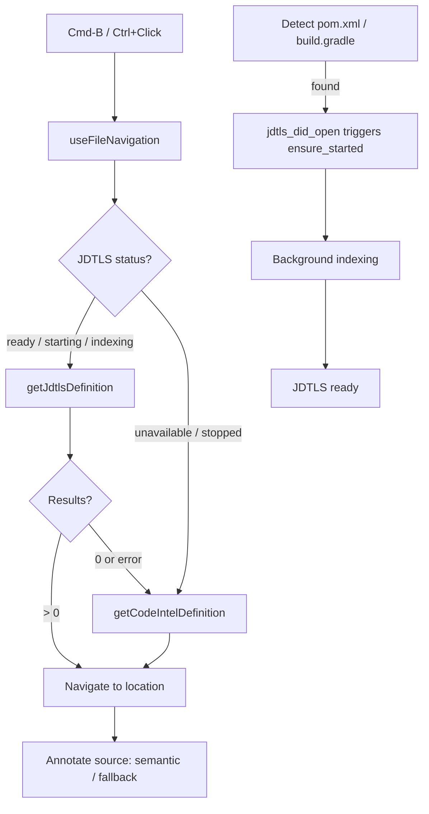
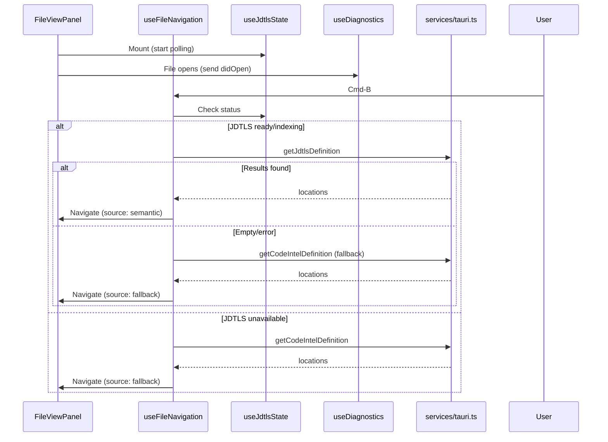

# JDTLS Navigation Priority Implementation Plan

## Summary

Activate the existing but unused JDTLS definition/references navigation for Java files, using frontend-side provider routing: JDTLS first, regex fallback. Add smart warmup to pre-start JDTLS when Maven/Gradle projects are detected, and fix the missing `initializationOptions` so JDTLS can properly index projects.

---

## Problem Frame

The JDTLS backend (`jdtls_definition`, `jdtls_references`) and frontend wrappers (`getJdtlsDefinition`, `getJdtlsReferences`) are fully wired but never called by the navigation flow -- they are dead code. The `useFileNavigation` hook only calls `getCodeIntelDefinition` (regex scan). Additionally, `initializationOptions` is `None` in the JDTLS initialize request, so the language server doesn't know about the JDK path or Maven configuration, causing slow or failed indexing.

The result: Spring Boot developers navigating Controller -> Service -> Repository get imprecise regex matches instead of true semantic jumps, and JDTLS never gets a chance to help.

---

## Requirements Traceability

| Requirement | Implementation Unit |
|---|---|
| R1 (JDTLS ready -> priority routing) | U3 |
| R2 (indexing -> try JDTLS, fallback) | U3 |
| R3 (unavailable -> regex only) | U3 |
| R4 (source annotation) | U2, U3 |
| R5 (smart warmup on pom.xml/build.gradle) | U1 |
| R6 (warmup + didOpen coordination) | U1, U4 |
| R7 (-data persistence, fast restart) | Already implemented |
| R8 (didOpen before definition) | U3 |
| R9 (didChange on file edit) | U3 |
| R10-R12 (initializationOptions) | U1 |
| R13 (shortcuts unchanged) | U3 |
| R14 (JDTLS results prioritized) | U3 |
| R15 (status indicator visible) | Already implemented |

---

## Key Technical Decisions

- **KTD1. Frontend-side provider routing.** `useFileNavigation` checks `useJdtlsState().status` and chooses `getJdtlsDefinition` vs `getCodeIntelDefinition`. Rationale: smallest change surface, reuses existing status polling, no new Tauri command needed. The `useDiagnostics` hook already demonstrates this JDTLS-calls pattern.

- **KTD2. Maven/Gradle detection in Rust backend.** A new lightweight Tauri command `detect_java_project` scans workspace root for `pom.xml`/`build.gradle`/`build.gradle.kts`. Rationale: filesystem scanning is safer in Rust (respects .gitignore, handles symlinks), and the result drives frontend warmup decisions.

- **KTD3. Fix initializationOptions as prerequisite (U1).** Without proper `settings.java.configuration.runtimes` and `settings.java.maven.downloadSources`, JDTLS indexing is unreliable. This is the foundation -- other units depend on JDTLS actually working.

- **KTD4. JDTLS warmup via didOpen notification.** `getJdtlsStatus` is a read-only poll and does not trigger `ensure_started`. The warmup uses `getJdtlsDidOpen` (which calls `ensure_started` internally) with the current Java file content to both start JDTLS and sync the file in one call. This reuses the existing `useDiagnostics` pattern.

---

## High-Level Technical Design

---

## Implementation Units

### U1. Fix JDTLS initializationOptions and add Java project detection

- **Goal:** Ensure JDTLS receives proper Maven/Gradle configuration during startup, and provide a backend command to detect whether the workspace is a Java project.
- **Requirements:** R5, R10, R11, R12
- **Dependencies:** None (prerequisite for all other units)
- **Files:**
  - Modify `src-tauri/src/jdtls/manager.rs` -- populate `initialization_options` with JDK runtimes, Maven settings, and build configuration
  - Modify `src-tauri/src/command_registry.rs` -- register new `detect_java_project` command
  - Modify `src-tauri/src/lib.rs` -- add command handler
  - Create command handler in `src-tauri/src/jdtls/commands.rs` or a new `src-tauri/src/java_project.rs`
  - Modify `src/services/tauri.ts` -- add `detectJavaProject` wrapper
- **Approach:**
  1. In `manager.rs`, replace `initialization_options: None` with a JSON object containing:
     - `settings.java.configuration.updateBuildConfiguration: "automatic"`
     - `settings.java.configuration.runtimes`: read from app settings (JDK path) if available, omit if not configured
     - `settings.java.maven.downloadSources: true`
     - `extendedClientCapabilities.classFileContentsSupport: true`
  2. Add a `detect_java_project` Tauri command that takes a `workspace_path` and checks for `pom.xml`, `build.gradle`, `build.gradle.kts` at root and one level deep. Returns `{ isJavaProject: boolean, buildSystem: "maven" | "gradle" | null }`.
  3. Add `detectJavaProject` wrapper in `tauri.ts`.
- **Patterns to follow:**
  - Existing `jdtls_get_status` command pattern for the new detection command
  - Existing `apply_java_path_from_settings` for reading JDK config
  - `didChangeConfiguration` payload shape already in `manager.rs` (line 344)
- **Test scenarios:**
  - `initializationOptions` includes `updateBuildConfiguration: automatic` when JDTLS starts.
  - `initializationOptions` includes JDK runtime path when user has configured one in settings.
  - `initializationOptions` omits `runtimes` gracefully when no JDK is configured (JDTLS uses JAVA_HOME).
  - `detect_java_project` returns `isJavaProject: true` for workspace with root `pom.xml`.
  - `detect_java_project` returns `isJavaProject: true` for workspace with `build.gradle.kts` in a subdirectory.
  - `detect_java_project` returns `isJavaProject: false` for a pure TypeScript workspace.
- **Verification:** JDTLS starts with proper config; `detect_java_project` correctly identifies Java projects.

### U2. Navigation result source type and cache key update

- **Goal:** Define the `NavigationSource` type and update the navigation cache to track whether results came from JDTLS (semantic) or regex (fallback).
- **Requirements:** R4
- **Dependencies:** None (can run in parallel with U1)
- **Files:**
  - Modify `src/features/files/utils/fileViewNavigationUtils.ts` -- add `NavigationSource` type, update `LocationCacheEntry` to include source
  - Create `src/features/files/utils/fileViewNavigationUtils.test.ts` if not exists -- test cache behavior with source field
- **Approach:**
  1. Add `type NavigationSource = "semantic" | "fallback"` to navigation utils.
  2. Extend `LocationCacheEntry` with `source: NavigationSource`.
  3. Update `readFreshCache` / cache set calls to carry source through.
  4. The cache key remains the same (file + line + character) -- source is metadata, not part of the key. A JDTLS result and a fallback result for the same position would not coexist in cache; whichever ran last wins.
- **Patterns to follow:**
  - Existing `LocationCacheEntry` and `readFreshCache` patterns
  - The cache already uses `expiresAt` TTL -- source is additive
- **Test scenarios:**
  - Cache entry created with `source: "semantic"` preserves the source on read.
  - Cache entry created with `source: "fallback"` preserves the source on read.
  - Expired entries are still evicted regardless of source.
  - Existing callers that don't specify source get a safe default (fallback).
- **Verification:** Unit tests confirm source tracking in cache without breaking existing callers.

### U3. Frontend JDTLS-first provider routing in useFileNavigation

- **Goal:** Modify `resolveDefinitionAtOffset` and `findReferencesAtOffset` to try JDTLS first and fall back to regex, with source annotation on results.
- **Requirements:** R1, R2, R3, R4, R13, R14
- **Dependencies:** U1 (JDTLS must start properly), U2 (source type)
- **Files:**
  - Modify `src/features/files/hooks/useFileNavigation.ts` -- add JDTLS-first routing logic
  - Modify `src/features/files/hooks/useFileNavigation.test.tsx` or `src/features/files/components/FileViewPanel.test.tsx` -- test routing behavior
- **Approach:**
  1. **Type normalization prerequisite:** `getJdtlsDefinition`/`getJdtlsReferences` in `tauri.ts` currently return `unknown`. Before using them in navigation, define return types in `tauri.ts` matching the LSP `Location[]` / `Location[]` shape, and add a `normalizeJdtlsLocations(response)` helper in `fileViewNavigationUtils.ts` that maps JDTLS responses to the same `LspLocationLike[]` format used by `extractLocations`.
  2. `useFileNavigation` receives `jdtlsStatus` as a new parameter (from `useJdtlsState` in `FileViewPanel`).
  2. In `resolveDefinitionAtOffset`, after cache miss:
     - If status is `ready`, `starting`, `indexing`, or `stopped`: call `getJdtlsDefinition` first for Java files. `stopped` means idle-stopped and restartable; the backend command calls `ensure_started`.
     - If JDTLS returns results: use them, tag as `source: "semantic"`.
     - If JDTLS returns empty or errors: fall back to `getCodeIntelDefinition`, tag as `source: "fallback"`.
     - If status is `unavailable`: go directly to `getCodeIntelDefinition`.
     - Before the JDTLS request, ensure the current Java document has been synced with `didOpen`/`didChange`. Reuse or extract the existing diagnostics document-sync behavior so navigation does not race a missing `didOpen`.
  3. Same pattern for `findReferencesAtOffset`.
  4. Cache entries store the source tag for UI display.
  5. Error handling: JDTLS timeout or error during `starting`/`indexing` is non-fatal, silently falls back. JDTLS error during `ready` state shows a lightweight toast and falls back.
  6. **Shortcuts and button behavior unchanged** (R13) -- only the internal provider selection changes.
- **Patterns to follow:**
  - Existing `useDiagnostics.ts` pattern for JDTLS calls with error handling
  - Current `resolveDefinitionAtOffset` request-id guard and debounce logic
  - The `withTimeout` wrapper already used for code_intel calls
- **Test scenarios:**
  - When JDTLS status is `ready` and returns one result: navigates directly, source is `semantic`.
  - When JDTLS status is `ready` and returns empty: falls back to regex, source is `fallback`.
  - When JDTLS status is `starting`: still attempts JDTLS, falls back on error.
  - When JDTLS status is `stopped`: attempts JDTLS and allows backend restart.
  - When JDTLS status is `unavailable`: goes directly to regex, no JDTLS call made.
  - Request-id guard still prevents stale responses from superseding newer ones.
  - Cache hit returns stored source correctly.
  - Same behavior applies to references (Alt-F7).
  - Cmd-B / Ctrl+Click / Alt-F7 shortcuts still work identically from user perspective.
- **Verification:** Component test mocks JDTLS status and verifies correct provider selection and fallback behavior.

### U4. Smart warmup trigger on Java file open

- **Goal:** Automatically start JDTLS in the background when a Java project is detected and a Java file is opened, so it's ready by the time the user navigates.
- **Requirements:** R5, R6
- **Dependencies:** U1 (detect_java_project command + fixed initializationOptions)
- **Files:**
  - Modify `src/features/files/components/FileViewPanel.tsx` -- add warmup effect
  - Or create `src/features/files/hooks/useJdtlsWarmup.ts` -- dedicated warmup hook (cleaner separation)
  - Modify `src/features/files/components/FileViewPanel.tsx` -- pass jdtlsStatus to useFileNavigation
- **Approach:**
  1. Create `useJdtlsWarmup` hook that:
     - On mount, calls `detectJavaProject(workspacePath)`.
     - If `isJavaProject` is true, calls `getJdtlsDidOpen(workspaceId, { filePath, content })` with the current Java file to trigger `ensure_started` in the backend and sync the file simultaneously. Note: `getJdtlsStatus` is read-only and does NOT start JDTLS.
     - Runs once per workspace (guard with ref).
  2. `FileViewPanel` mounts `useJdtlsWarmup(workspacePath, workspaceId, filePath, content, fileIsJava)` alongside existing `useJdtlsState()`.
  3. `useJdtlsState` polling continues to track status transition from `starting` -> `ready`.
  4. Pass `jdtlsStatus` from `useJdtlsState` into `useFileNavigation` as a new parameter.
- **Patterns to follow:**
  - Existing `useJdtlsState` polling pattern
  - `useDiagnostics` mount-triggered JDTLS calls
  - `useEffect` with mountedRef for cleanup safety (hook guidelines)
- **Test scenarios:**
  - When workspace has `pom.xml`: warmup hook calls `detectJavaProject` and triggers JDTLS start.
  - When workspace has no build files: warmup hook does not trigger JDTLS.
  - Warmup runs only once per workspace mount (not on every re-render).
  - JDTLS status transitions from `starting` to `ready` are reflected via `useJdtlsState`.
  - Component unmount during warmup does not cause state-update-on-unmounted warning.
- **Verification:** Mounting `FileViewPanel` on a Java file inside a detected Java project triggers JDTLS startup; status transitions visible in the ProviderStatusBadge.

---

## Scope Boundaries

**Deferred for later**

- `textDocument/hover` (hover tooltips): JDTLS declares hoverProvider capability but no `jdtls_hover` command exists yet.
- `textDocument/completion` (code completion): requires CodeMirror completion integration, significantly higher complexity.
- `textDocument/implementation` (go to implementation): `getJdtlsImplementation` wrapper exists but is not wired into navigation.
- `$/progress` notification listening: `LspClient` currently only handles request responses, not server-initiated notifications. Could later show precise indexing progress.

**Outside scope**

- Non-Java file semantic navigation (Python, Go, TS, YAML continue with regex only).
- Full IDE features (debugging, refactoring, Maven lifecycle panel).

**Deferred to Follow-Up Work**

- Navigation source label in the UI (showing "semantic" / "fallback" badge near results) -- the data is tracked but visible labeling can be a follow-up.

---

## Risks And Dependencies

- **R1. JDTLS may fail to start on machines without JDK 17+.** Mitigation: `detect_java_project` can also check for `JAVA_HOME` or common JDK paths; `jdtls_get_status` returns `unavailable` gracefully, and the regex fallback is always available.
- **R2. JDTLS indexing may be slow for large multi-module Maven projects.** Mitigation: the warmup starts early (on workspace open), -data persistence speeds up subsequent starts, and the frontend gracefully falls back during indexing.
- **R3. Document sync coordination between warmup/diagnostics/navigation.** If diagnostics or warmup already sent `didOpen`, navigation should not duplicate it unnecessarily; if neither has completed yet, navigation must still sync before requesting definition/references. Mitigation: extract shared document sync state or provide an idempotent helper used by both warmup and navigation.
- **D1.** Existing `getJdtlsDefinition` / `getJdtlsReferences` wrappers in `tauri.ts` return `unknown` -- type normalization is needed before use in navigation (part of U3).
- **D2.** The `useFileNavigation` hook signature changes (new `jdtlsStatus` parameter) -- all callers must be updated.

---

## Sources And Research

- Repo code: `src-tauri/src/jdtls/commands.rs` -- `jdtls_definition` / `jdtls_references` already implemented
- Repo code: `src-tauri/src/jdtls/manager.rs:308` -- `initialization_options: None` (to be fixed)
- Repo code: `src/features/files/hooks/useFileNavigation.ts:205` -- `resolveDefinitionAtOffset` (main routing target)
- Repo code: `src/features/files/hooks/useDiagnostics.ts:54` -- existing JDTLS document sync pattern
- Repo code: `src/features/files/hooks/useJdtlsState.ts` -- status polling (to be consumed by navigation)
- Repo code: `src/services/tauri.ts:1323` -- `getJdtlsDefinition` wrapper (to be called from navigation)
- External: VS Code redhat.java extension starts JDTLS on pom.xml detection, serves during indexing
- Origin: `docs/brainstorms/2026-06-14-jdtls-navigation-priority-requirements.md`
- Related: `docs/plans/2026-06-09-002-feat-java-code-navigation-plan.md` (broader Java navigation plan, U3 provider router concept)
