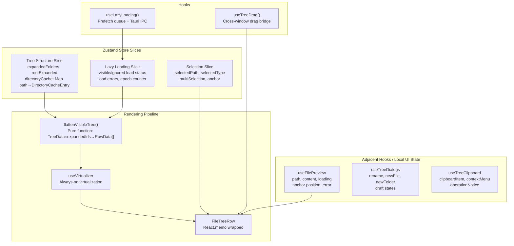
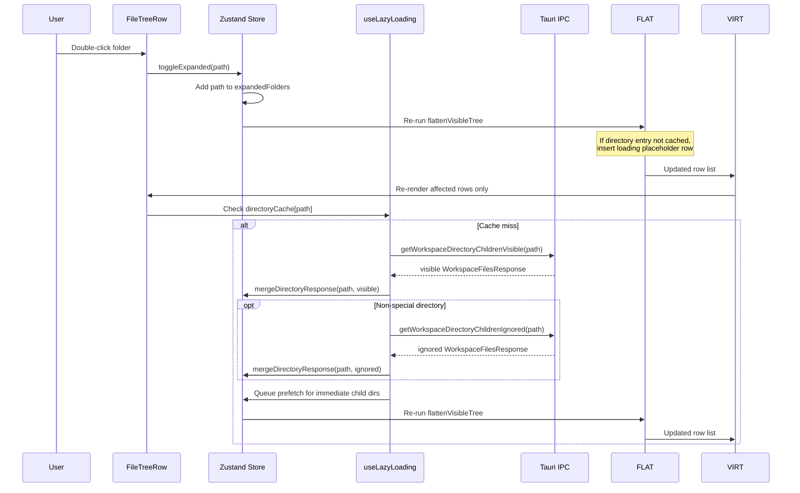

# refactor: Extract file tree state into Zustand store and unify rendering pipeline

## Summary

Decompose the 3373-line `FileTreePanel.tsx` monolith in phases: first extract tree model and lazy-loading state into a feature-local Zustand store, then unify the dual rendering paths (recursive `renderNode` vs flat `renderVirtualTreeRow`) into a single flatten-then-virtualize pipeline, then migrate adjacent UI state only where it directly supports the unified tree workflow.

## Problem Frame

`FileTreePanel.tsx` is a 3373-line monolith with 32 `useState` + 22 `useRef` declarations handling tree building, lazy loading orchestration, virtualization, selection, context menus, file operations, preview, drag-and-drop, and keyboard shortcuts. Two completely separate rendering functions — `renderNode` (recursive, below 250 rows) and `renderVirtualTreeRow` (flat, above 250 rows) — duplicate ~120 lines of nearly identical JSX each, with behavioral divergence (animation in recursive path, no animation in virtual path). The lazy loading subsystem alone spans ~965 lines with 10+ state pairs and unbounded prefetch queues. This architecture is untestable, hard to reason about, and causes state loss on unmount.

Performance baseline shows a 500-row scenario at 170ms commit duration (non-virtualized path), while the 1000-row virtualized path runs at 34ms — confirming the threshold-based branching hurts rather than helps.

---

## Requirements

### State Management Extraction

- R1. Tree state (expanded folders, directory cache, loading states, errors) is managed by a Zustand store, not component-local useState.
- R2. The store exposes selector-based subscriptions so individual tree rows re-render only when their own state changes (expanded, loading, children) — not when unrelated nodes update.
- R3. Directory cache is a `Map<path, DirectoryCacheEntry>` keyed by directory path, with visible children, ignored children, metadata, per-phase loading/error status, and confirmed-empty state. The store owns this cache; components read normalized row data from it.
- R4. Lazy load state includes visible and ignored phase status (`loadingVisibleDirs`, `loadedVisibleDirs`, `visibleLoadErrors`, `loadingIgnoredDirs`, `loadedIgnoredDirs`, `ignoredLoadErrors`). Ref-based deduplication for in-flight requests is preserved inside the lazy-loading hook instance.
- R5. An epoch counter (`lazyLoadEpochRef` equivalent) in the store invalidates stale async responses when the workspace changes.

### Phased State Migration

- R6. Selection state (primary selected path/type, multi-selection set, selection anchor) moves with the tree store because row rendering, keyboard actions, and cross-window drag source calculation consume it.
- R7. Preview, dialog, clipboard, context menu, and operation notice state remain in focused hooks during the first pass unless a unit proves that store ownership removes duplication or race-prone state mirrors.
- R8. File operations (rename, new file/folder, copy/paste/delete) keep their Tauri side effects in hooks and continue to call `src/services/tauri.ts`; the store only receives normalized state updates after successful operations.
- R9. Store migration must not change parent runtime ownership of `files`, `directories`, `directoryMetadata`, `gitignoredFiles`, `gitignoredDirectories`, `gitStatusFiles`, `isLoading`, or `loadError`.
- R10. Any later migration of preview/dialog/clipboard state is follow-up work unless it is needed to complete the unified rendering pipeline.

### Unified Rendering Path

- R11. A single `flattenVisibleTree(data, expandedIds)` function produces the flat list of visible rows with depth information, replacing both `renderNode` and `renderVirtualTreeRow`.
- R12. The flat list feeds `@tanstack/react-virtual`'s `useVirtualizer` unconditionally — virtualization is always active (the 250-row threshold is removed; react-virtual handles small lists efficiently with zero overhead).
- R13. Each row is a `React.memo`-wrapped component receiving minimal props (node data, depth, event handlers). This eliminates the current inline arrow functions that break memoization.
- R14. Event handlers (click, double-click, context menu, drag) are stable callback references from hooks/store actions/parent callbacks, not recreated per-render inline functions.

### Lazy Loading Pipeline

- R15. Lazy loading follows the standard pattern: expand → check cache → if miss, show loading indicator → fetch via Tauri IPC → write to store cache → hide loading indicator.
- R16. Prefetch logic: after loading a directory's visible children, queue prefetch for immediate child directories. Prefetch is bounded (max N concurrent, configurable).
- R17. The prefetch queue uses a bounded concurrency controller (e.g., p-limit pattern) instead of the current unbounded `pendingPrefetchDirectoryLoadsRef`.

### Maintainability

- R18. `FileTreePanel.tsx` is decomposed into: Zustand store module, tree builder (pure function), row component, tree container component, and event handler hooks.
- R19. The tree builder (`buildTree` / `flattenVisibleTree`) is a pure function with no React dependency — testable independently.
- R20. Existing core behaviors are preserved: folder chain collapsing, special directory handling (node_modules, dist, etc.), active editor sync scroll, selection, context actions, and drag bridge. `FileTreeChildren` height animation is explicitly deferred for the first unified virtualized path.

---

## Key Technical Decisions

KTD-1. **Zustand over Context/useReducer.** Zustand's selector pattern prevents re-render cascades. Each tree row subscribes to only its own slice via `useStore(selector, shallow)`. This is the approach used by react-arborist (Redux + useSyncExternalStore, same principle). With 54 state declarations, a single Context would cause full-subtree re-renders on every state change. *(see origin: requirements doc, Key Decisions)*

KTD-2. **Always-virtualize over threshold.** The 250-row threshold creates a qualitative UX break (animated collapse in recursive path, no animation in virtual path) with no measurable benefit — @tanstack/react-virtual with fixed-size rows costs near-zero for small lists. Performance baseline confirms: 1000 virtualized rows (34ms) outperform 500 non-virtualized rows (170ms). Removing the threshold eliminates ~420 lines of duplicate rendering code. *(see origin: requirements doc, Key Decisions)*

KTD-3. **Phased migration over big-bang rewrite.** The origin requirements explicitly prefer incremental migration. The first implementation pass moves tree, lazy-loading, expansion, selection, and path-pruning state into the store because those states directly drive row derivation. Preview, dialogs, clipboard, context menu, and operation notices stay in hooks/component composition until the unified tree pipeline is stable. This keeps rollback practical and avoids rewriting every file-tree workflow at once.

KTD-4. **Feature-local store over global singleton.** The Zustand store is created per `FileExplorerWorkspace` instance via React context, not as a global singleton. The main explorer and each detached file explorer window get independent store instances for the same workspace id. Tree state is workspace-instance-specific and should be garbage-collected when that explorer unmounts.

KTD-5. **Bounded prefetch concurrency.** Replace the unbounded `pendingPrefetchDirectoryLoadsRef` array + single in-flight ref with a p-limit-style bounded concurrency controller. Max concurrent prefetches capped at 3 (configurable). This prevents request flooding when expanding a directory with many subdirectories.

KTD-6. **Directory cache record over raw children map.** `childrenCache: Map<path, Node[]>` is too small for the current two-phase loading semantics. The store uses `directoryCache: Map<string, DirectoryCacheEntry>` where each entry can track visible children, ignored children, metadata, child state, loading/error state for each phase, confirmed-empty status, and timestamps/epoch. `flattenVisibleTree` consumes normalized row data from this record instead of assuming one children array is authoritative.

KTD-7. **Animation is not a blocker for path unification.** The first unified virtualized path preserves row state, icons, selection, keyboard behavior, active-editor sync, lazy loading indicators, and context actions. Collapse height animation from `FileTreeChildren` is not required in the first implementation because the flat virtualized DOM cannot reuse the recursive wrapper directly. A follow-up may add virtual-row transition support after correctness and performance are stable.

---

## High-Level Technical Design

### Store Architecture



### Data Flow: Expand Folder



---

## Scope Boundaries

**In scope:**
- Feature-local Zustand store creation for tree/lazy/selection state slices
- Pure tree model extraction (buildTree, flattenVisibleTree, helpers)
- Unified rendering pipeline (flatten → virtualize → memo row)
- Lazy loading consolidation with bounded prefetch queue
- FileTreePanel decomposition into store + hooks + row component + container
- Existing core behaviors preserved (special dirs, editor sync, selection, context actions, drag bridge)

**Deferred for later:**
- Backend streaming / pagination API for large directories (`has_more` field in `WorkspaceDirectoryEntry`)
- Search / filter UI in the file tree
- Expanded state persistence across sessions
- Drag-and-drop architecture improvements (cross-window drag bridge stays as-is)
- Preview/dialog/clipboard/context-menu state migration unless required by the rendering pipeline
- CSS-based expand/collapse height animation for virtualized rows

**Outside this refactor:**
- Detached file explorer architecture changes. The current detached explorer still receives the new provider because it renders `FileExplorerWorkspace`; it must be regression-tested, but no new detached-window feature work is in scope.
- File watcher / polling logic — lives in `useWorkspaceFiles`, outside the tree component

---

## Implementation Units

### U0. Confirm dependency and store lifecycle contract

**Goal:** Make the new state-management dependency and store ownership boundary explicit before store implementation starts.

**Requirements:** R1, R2, R9

**Dependencies:** None.

**Files:**
- Modify: `package.json` / lockfile (install `zustand`, pinned by the package manager)

**Approach:**
- Install `zustand` as a normal dependency before any store code imports it.
- Record the lifecycle contract for the implementation units: create a feature-local store factory, do not export a global singleton store, and provide the store through `FileTreeStoreProvider` scoped to each `FileExplorerWorkspace` instance.
- The main explorer and each detached explorer window must receive separate store instances even when they point at the same `workspaceId`.
- Keep runtime inputs (`files`, `directories`, `directoryMetadata`, `gitignoredFiles`, `gitignoredDirectories`, `gitStatusFiles`, `isLoading`, `loadError`) owned by the existing parent data-loading path. The store may derive normalized tree state from these inputs, but it is not the runtime source of truth.

**Test scenarios:**
- Dependency is installed and lockfile is updated.
- Store lifecycle isolation tests are implemented in U2 once the store factory exists.

**Verification:** `zustand` appears in dependencies and lockfile; lifecycle contract is carried into U2 tests.

---

### U1. Extract pure tree model utilities

**Goal:** Move all pure tree-building and tree-traversal functions out of `FileTreePanel.tsx` into a testable utility module with zero React dependencies.

**Requirements:** R19, R20 (special directory handling, folder chain collapsing)

**Dependencies:** None — this is the pure-function foundation for subsequent units.

**Files:**
- Create: `src/features/files/utils/treeModel.ts`
- Create: `src/features/files/utils/treeModel.test.ts`

**Approach:**
Extract the following functions currently defined at module scope or inline in `FileTreePanel.tsx`:
- `buildTree(entries, rootPath)` — builds the tree data structure from flat entry list
- `flattenVisibleTree(nodes, expandedIds)` — produces flat visible rows with depth info (new, replaces current `visibleFileTreeRows` useMemo logic)
- `isSuppressedFileTreePath(path)` / `filterSuppressedFileTreePaths(nodes)` — path suppression logic
- `isGitignoredFileTreeNode(node)` / `getGitignoredFolderAncestorPaths(nodes)` — gitignore classification
- `isSpecialDirectoryPath(path)` — special dependency/build artifact directory detection
- `SPECIAL_DEPENDENCY_DIRECTORIES` and `SPECIAL_BUILD_ARTIFACT_DIRECTORIES` constants
- `lazyLoadDirectoryNode` helper — creates placeholder loading nodes
- `isConfirmedEmptyDirectoryResponse` — checks if a directory response is confirmed empty
- `hasWorkspaceDirectoryEntries` — checks if a directory response has entries

The `flattenVisibleTree` function is new — it replaces both the `visibleFileTreeRows` useMemo (lines 1275-1307) and the recursive `renderNode` traversal. It produces a `RowData[]` array where each entry carries: `node`, `depth`, `kind` (normal | lazy-loading | lazy-error | lazy-empty), and `isExpandable`. This function must handle the lazy state row insertion logic currently duplicated in both rendering paths. It should consume normalized tree/cache inputs rather than calling Tauri services or reading React state directly.

**Patterns to follow:**
- Pure functions at module scope, no React imports
- Types defined alongside functions in the same file
- Follow existing naming conventions in `src/features/files/`

**Test scenarios:**
- Happy path: `flattenVisibleTree` with a 3-level deep tree returns correct depth and ordering
- Expanded folder: children of expanded folder appear in flat list with correct depth
- Collapsed folder: children of collapsed folder are excluded
- Empty tree: returns empty array
- Lazy loading placeholder: folder with no cached children returns a loading placeholder row
- Special directories: node_modules, dist, etc. are flagged as lazy-loadable
- Deeply nested: 10+ level nesting produces correct depth values

**Verification:** Pure functions pass all unit tests. No React dependency. `FileTreePanel.tsx` temporarily re-exports from the new module to maintain backward compatibility during migration.

---

### U2. Create Zustand store for tree, lazy loading, and selection

**Goal:** Create the first-pass Zustand store for state that directly drives tree row derivation and tree interactions. Do not migrate preview/dialog/clipboard/context-menu state in this unit.

**Requirements:** R1-R6, R8-R10, R2 (selector subscriptions)

**Dependencies:** U0 (store dependency/lifecycle), U1 (tree model types and helpers)

**Files:**
- Create: `src/features/files/stores/fileTreeStore.ts`
- Create: `src/features/files/stores/fileTreeStore.test.ts`
- Create: `src/features/files/stores/fileTreeStoreContext.tsx`
- Create: `src/features/files/stores/fileTreeStoreContext.test.tsx`
- Create: `src/features/files/stores/types.ts` (shared types for store state)

**Approach:**
Create a Zustand store with the following slices, each exposed as a named selector for fine-grained subscriptions:

**Tree Structure slice:**
- `expandedFolders: Set<string>` + `rootExpanded: boolean`
- `directoryCache: Map<string, DirectoryCacheEntry>` — directory path → normalized directory cache record
- `treeData: TreeNode[]` — the root tree built from workspace entries
- `suppressedDeletedPaths: Set<string>` — local suppression for deleted paths until parent runtime refresh catches up
- Actions: `toggleExpanded(path)`, `setTreeData(entries, rootPath)`, `mergeDirectoryResponse(path, response, phase)`, `suppressDeletedPath(path)`, `resetTreeState()`

**DirectoryCacheEntry shape:**
- `visibleChildren: TreeNode[]`
- `ignoredChildren: TreeNode[]`
- `metadataByPath: Map<string, WorkspaceDirectoryEntry>`
- `childState: WorkspaceDirectoryChildState | null`
- `visibleStatus: 'idle' | 'loading' | 'loaded' | 'error'`
- `ignoredStatus: 'idle' | 'loading' | 'loaded' | 'error'`
- `visibleError: string | null`
- `ignoredError: string | null`
- `confirmedEmpty: boolean`
- `loadedEpoch: number`

The exact type may change during implementation, but it must express the current visible/ignored two-phase behavior and cannot collapse everything into one children array.

**Lazy Loading slice:**
- `loadingVisibleDirs: Set<string>`, `loadedVisibleDirs: Set<string>`, `visibleLoadErrors: Map<string, string>`
- `loadingIgnoredDirs: Set<string>`, `loadedIgnoredDirs: Set<string>`, `ignoredLoadErrors: Map<string, string>`
- `lazyMetadata: Map<string, WorkspaceDirectoryEntry>`
- `epoch: number` — monotonic counter for invalidating stale responses
- Actions: `startVisibleLoad(path)`, `completeVisibleLoad(path, response)`, `failVisibleLoad(path, error)`, `startIgnoredLoad(path)`, `completeIgnoredLoad(path, response)`, `failIgnoredLoad(path, error)`, `incrementEpoch()`

**Selection slice:**
- `selectedPath: string | null`, `selectedType: 'file' | 'folder' | null`
- `multiSelection: Set<string>`, `selectionAnchor: string | null`
- Actions: `selectNode(path, type)`, `toggleSelection(path)`, `rangeSelect(from, to, visiblePathOrder)`, `clearSelection()`, `pruneSelection(existingPaths)`

**Non-store state in this unit:**
- Preview state remains in `FileTreePanel` / `useFilePreview`.
- Dialog state remains in `FileTreePanel` / `useTreeDialogs`.
- Clipboard, context menu, and operation notice remain in `FileTreePanel` / operation hooks.
- DOM refs and drag bridge mutable guards remain refs in hooks, not Zustand state.

**Key design decisions:**
- Use Zustand's `shallow` equality for selectors returning objects/arrays to prevent unnecessary re-renders
- Ref-based deduplication for in-flight lazy loads lives in `useLazyFileTree`, scoped per provider instance. Do not use a module-level `Set<string>` because multiple explorer instances would share it accidentally.
- The store is NOT a global singleton — it's created via a factory function and provided through React context tied to `FileExplorerWorkspace` lifecycle

**Patterns to follow:**
- Zustand slice pattern with `StateCreator` for each logical group
- TypeScript interfaces for all state and action types
- Module-level EMPTY_SET / EMPTY_MAP constants for default prop values per frontend spec

**Test scenarios:**
- Toggle expanded: calling `toggleExpanded(path)` adds path to `expandedFolders`; calling again removes it
- Merge visible response: `completeVisibleLoad(path, response)` updates the directory cache without losing ignored children
- Merge ignored response: `completeIgnoredLoad(path, response)` updates ignored children without overwriting visible children
- Selection: `selectNode` sets primary selection; `toggleSelection` adds to multi-selection set
- Lazy load lifecycle: visible and ignored load status transition independently
- Epoch increment: `incrementEpoch()` increments counter; stale responses check against current epoch
- Selector isolation: subscribing to `selectedPath` does not re-render when directory cache for an unrelated path changes
- Existing path pruning: deleting a folder clears descendant expansion, cache, lazy status, and selection state
- Provider creates one store per mounted provider
- Remounting provider creates a fresh store
- Two providers with the same `workspaceId` do not share expansion/selection state

**Verification:** Unit tests pass for store actions and selector isolation behavior. Store can be instantiated independently of React.

---

### U3. Create lazy loading hook with bounded prefetch

**Goal:** Consolidate the ~965 lines of lazy loading orchestration (prefetch queues, ignored directory queues, race condition guards) into a dedicated hook that writes normalized directory responses to the Zustand store.

**Requirements:** R4, R5, R15, R16, R17

**Dependencies:** U2 (Zustand store)

**Files:**
- Create: `src/features/files/hooks/useLazyFileTree.ts`
- Create: `src/features/files/hooks/useLazyFileTree.test.ts`

**Approach:**
Extract the lazy loading subsystem from `FileTreePanel.tsx` (lines 820-1067, 1616-1786) into a self-contained hook:

- **Bounded prefetch queue:** Replace `pendingPrefetchDirectoryLoadsRef` (unbounded array) + `inFlightPrefetchDirectoryLoadRef` (single in-flight) with a concurrency-limited queue (max 3 concurrent). Use a simple async semaphore pattern — no external dependency needed.
- **Ignored directory queue:** Replace `pendingIgnoredDirectoryLoadsRef` + `inFlightIgnoredDirectoryLoadRef` with a second bounded queue (max 1 concurrent, since ignored loads are lower priority).
- **Race condition guards:** Preserve `activeWorkspaceIdRef` and epoch-based invalidation. In-flight request sets, queue state, and latest-workspace refs live inside the hook instance, not module scope.
- **Two-phase loading:** Special dependency/build directories use `getWorkspaceDirectoryChildren()`; other directories use `getWorkspaceDirectoryChildrenVisible()` first, then `getWorkspaceDirectoryChildrenIgnored()` for gitignored entries.
- **Confirmed-empty handling:** Preserve the current `isConfirmedEmptyDirectoryResponse` and parent state override semantics so visible-empty directories can still receive ignored entries before being marked truly empty.
- **Root snapshot change detection:** `previousRootSnapshotRef` logic for detecting when to selectively reload expanded lazy folders.
- **Reset on workspace change:** When `workspaceId` changes, increment epoch and clear lazy state via store actions.

The hook returns stable action functions needed by UI code (`loadDirectory`, `retryDirectory`, `refreshExpandedLazyDirectories`) and also reacts to expansion state where appropriate. Components may toggle expansion through the store, but explicit retry buttons should call a stable hook action rather than reaching into queue internals.

**Patterns to follow:**
- Hook naming: `useLazyFileTree`
- All Tauri IPC calls through `src/services/tauri.ts`
- Event listener cleanup in `useEffect` return
- Ref guards for async operations (same pattern as current code, but consolidated)

**Test scenarios:**
- Expand uncached folder: triggers IPC call, writes children to store, marks directory as loaded
- Expand already-cached folder: no IPC call, children read from cache
- Concurrent expand: expanding 3 folders simultaneously respects max 3 prefetch concurrency
- Special directory: uses full directory children command, not visible-only command
- Visible empty with ignored entries: ignored response can populate children before the row becomes empty
- Workspace change: epoch increments, in-flight requests are invalidated
- Error handling: IPC failure writes error to the relevant visible/ignored error map, shows error placeholder row
- Prefetch: after loading a directory, child directories are queued for prefetch (up to concurrency limit)
- Reset: calling reset clears all lazy state and expanded folders

**Verification:** Hook renders correctly in test environment. IPC calls are mocked and verified. Concurrency limits are respected in integration test.

---

### U4. Create operation and adjacent UI hooks without expanding store scope

**Goal:** Extract preview, file operation dialog, clipboard/context menu, and drag bridge logic into focused hooks while keeping non-tree state local to those hooks unless a later unit proves store ownership is necessary.

**Requirements:** R7-R10, R20 (preserve existing behaviors)

**Dependencies:** U2 (Zustand store)

**Files:**
- Create: `src/features/files/hooks/useFilePreview.ts`
- Create: `src/features/files/hooks/useTreeDialogs.ts`
- Create: `src/features/files/hooks/useTreeClipboard.ts`
- Create: `src/features/files/hooks/useTreeDrag.ts`
- Create: `src/features/files/hooks/useFileTreeHooks.test.ts` (tests for all four hooks)

**Approach:**

**useFilePreview:** Extract preview state management and effects (lines 1470-2026 of FileTreePanel.tsx):
- Preview open/close logic with popover positioning
- Preview content loading via Tauri IPC (text file reading)
- Preview line selection (drag-select, shift-click range)
- Truncation detection
- Returns: local preview state + action functions + refs for DOM measurements

**Selection:** Selection actions live in the store from U2. U4 may add a thin `useTreeSelectionActions` helper if UI event handlers need stable wrappers around store actions, but it should not create another state owner.

**useTreeDialogs:** Extract dialog state and handlers (lines 2256-2391):
- Rename dialog: open, draft name update, confirm (calls Tauri IPC rename), cancel
- New file dialog: open, name input, confirm (calls Tauri IPC create), cancel
- New folder dialog: same pattern
- Returns: local dialog state + action functions + input refs

**useTreeClipboard:** Extract clipboard and file operations (lines 2148-2254):
- Copy, paste, duplicate, trash/delete operations
- Operation notice state remains local to this hook/component composition in the first pass
- Context menu builder function
- Returns: clipboard/context-menu local state + stable action functions

**useTreeDrag:** Extract cross-window drag bridge logic from duplicated row handlers:
- Active drag source paths and broadcast throttling remain refs.
- The hook reads current ordered selection from the store via selectors.
- The hook exposes stable `onDragStart`, `onDrag`, and `onDragEnd` callback builders or row-level action handlers.

**Patterns to follow:**
- Each hook encapsulates one concern
- Hooks call store actions for tree/selection/cache updates; non-tree UI state may remain local to the hook
- Tauri IPC calls through `src/services/tauri.ts`
- Input refs managed within hooks (these are DOM refs, not reactive state)

**Test scenarios:**
- Preview: opening a file sets previewPath and loads content; closing clears all state
- Rename: opening rename sets prompt; confirming calls IPC and updates treeData
- New file: confirming creates file via IPC and refreshes parent children
- Clipboard: copy stores path; paste calls IPC with stored path
- Context menu: right-click builds correct menu items based on node type and selection
- Drag bridge: drag start uses current ordered selection, broadcasts absolute paths, and cleanup runs on drag end/unmount

**Verification:** Each hook tested independently with mocked store and IPC. Integration test verifies hooks coordinate with the shared tree store without duplicating selection state.

---

### U5. Build unified rendering pipeline

**Goal:** Create the single rendering path that replaces both `renderNode` and `renderVirtualTreeRow`, using the `flattenVisibleTree` function and a memoized row component.

**Requirements:** R11, R12, R13, R14

**Dependencies:** U1 (flattenVisibleTree), U2 (Zustand store)

**Files:**
- Create: `src/features/files/components/FileTreeRow.tsx`
- Create: `src/features/files/components/FileTreeRow.test.tsx`
- Create: `src/features/files/components/FileTreeContainer.tsx`
- Create: `src/features/files/components/FileTreeContainer.test.tsx`

**Approach:**

**FileTreeRow:** A `React.memo`-wrapped component that renders a single tree row. Props:
- `node: TreeNode` — the file/folder data
- `depth: number` — indentation level
- `kind: 'normal' | 'lazy-loading' | 'lazy-error' | 'lazy-empty'` — row variant
- `isExpanded: boolean` — whether folder is expanded
- `isSelected: boolean` — whether this row is selected
- `isMultiSelected: boolean` — whether in multi-selection
- `isEditorActive: boolean` — whether this file is open in editor

Event handlers are stable references from hooks/store — not inline functions. The row renders:
- Indentation spacer (depth × indentWidth)
- Expand/collapse chevron (for folders)
- File/folder icon with git status indicator
- File/folder name
- Loading spinner / error indicator (for lazy state rows)
- Context menu trigger
- Drag source attributes

The row does NOT own event handlers — it calls stable callbacks passed via props. This eliminates the current ~120 lines of duplicated inline handlers per rendering path.

**FileTreeContainer:** The virtualized container that:
- Subscribes to `treeData`, `expandedFolders`, selection state, and directory cache selectors from the store
- Calls `flattenVisibleTree` in a `useMemo` to produce the flat row list
- Feeds the flat list to `useVirtualizer` (always active, no threshold)
- Renders `FileTreeRow` for each virtual row
- Manages the scroll container ref
- Handles global keyboard shortcuts (Cmd+Delete for trash, Cmd+C for copy, Escape for preview close)

**Animation decision:** The current `renderNode` path uses `FileTreeChildren` for animated expand/collapse (220ms collapse delay). The first unified virtualized path does not attempt height animation because flat virtual rows cannot be wrapped in the same recursive `FileTreeChildren` structure. Acceptance for this refactor is behavioral parity excluding height animation: no duplicate rendering paths, correct row state, correct lazy placeholders, stable scrolling, and no regressions to selection/drag/context actions. Height animation is follow-up work.

**Patterns to follow:**
- `React.memo` with shallow comparison for row component
- Module-level `EMPTY_SET` for default Set props
- `@tanstack/react-virtual` `useVirtualizer` API (same pattern as `MessagesTimeline`, `GitHistoryPanelImpl`)

**Test scenarios:**
- Render: FileTreeRow renders correct indentation for depth 0, 1, 3
- Expanded folder: chevron rotates when expanded
- Lazy loading row: shows spinner icon
- Lazy error row: shows error indicator
- Selection styling: selected row has correct CSS class
- Memo isolation: changing unrelated store state does not re-render unchanged rows
- Virtualizer: container renders only visible rows (not all 1000+)
- Keyboard shortcut: Cmd+Delete triggers trash action on selected nodes
- Context menu: right-click opens menu with correct items

**Verification:** Visual regression test: file tree looks identical to current implementation except for recursive-path collapse height animation. Performance test: 1000 rows renders with <50ms commit duration (matching current virtualized baseline).

---

### U6. Refactor FileTreePanel to compose store + hooks + rendering

**Goal:** Refactor `FileTreePanel.tsx` into a thinner composition layer that wires the Zustand store, hooks, and unified rendering pipeline together. Avoid promising a fixed line count; the success metric is removal of duplicated render paths and isolated state/orchestration modules.

**Requirements:** R1, R18, R20 (preserve all existing behaviors)

**Dependencies:** U1-U5 (all prior units)

**Files:**
- Modify: `src/features/files/components/FileTreePanel.tsx` (major rewrite)
- Modify: `src/features/files/components/FileExplorerWorkspace.tsx` (minor: wrap the tree panel in the store provider)
- Modify: `src/features/layout/hooks/useLayoutNodes.tsx` only if a prop is truly removed from `FileTreePanel`

**Approach:**

**Store provider:** Use the provider created in U0:
- It creates a Zustand store instance via factory function.
- It provides the store to the component subtree.
- It naturally releases the store on unmount with the provider instance.
- It is mounted for both main and detached `FileExplorerWorkspace` render paths.

**FileExplorerWorkspace.tsx (minor modification):**
- Wrap `FileTreePanel` with the store provider.
- Do not remove runtime input props merely to reduce prop count. Runtime file data and status still flow from the parent loader into the tree.
- Retain layout-only props (sidebar width, collapse state, resize handler).

**FileTreePanel.tsx (major rewrite):**
The 3373-line monolith becomes a composition around focused modules:

```
FileTreePanel
├── useLazyFileTree()          // lazy loading orchestration
├── useFilePreview()           // preview state + effects
├── useTreeDialogs()           // rename/new file/folder dialogs
├── useTreeClipboard()         // copy/paste/delete
├── useTreeDrag()              // cross-window drag bridge
├── useEffect(editorSync)      // active editor scroll sync
├── useEffect(rootSnapshot)    // root change detection
└── render:
    ├── FileTreeRootActions    // refresh + detached explorer buttons
    ├── FileTreeContainer      // virtualized row list
    ├── Dialogs (rename, new file, new folder)
    ├── FilePreviewPopover     // portaled preview
    └── OperationNotice        // toast notifications
```

The component's render function becomes a composition of sub-components. Tree/lazy/selection state is delegated to the store, side effects and adjacent UI state are delegated to hooks, and the component keeps only transient DOM state (for example `panelRef`) plus props needed from the app layer.

**Props policy:** Do not use prop-count reduction as a primary success metric. Keep external runtime inputs and app callbacks (`files`, `directories`, `directoryMetadata`, gitignored sets, git status, loading/error state, `onInsertText`, `onOpenFile`, `onRefreshFiles`) as props. Remove only props that have become internal implementation details.

**Patterns to follow:**
- Component owns rendering; hooks own orchestration; store owns state (per frontend spec)
- Store context provider for lifecycle management
- Prefer store selectors in tree children; keep app/runtime boundary props explicit

**Test scenarios:**
- Mount: component renders with empty tree, no errors
- Full workflow: expand folder → lazy load → select file → preview → open file
- Workspace change: switching workspace resets tree state and reloads
- Runtime input preservation: parent file-list props still drive tree rebuilds
- Detached explorer: FileTreePanel works when rendered in DetachedFileExplorerWindow
- Performance: 1000 rows with rapid expand/collapse does not exceed 50ms commit duration
- Store lifecycle: expanding folders in one explorer instance does not affect another explorer instance for the same workspace

**Verification:** All existing integration tests in `FileTreePanel.run.test.tsx` pass (with updates for new import paths). Manual testing: file tree behaves identically to pre-refactor version.

---

### U7. Clean up and remove dead code

**Goal:** Remove all deprecated code from the original monolith, update imports across the codebase, and ensure no dead code remains.

**Requirements:** R18

**Dependencies:** U6

**Files:**
- Modify: `src/features/files/components/FileTreePanel.tsx` (remove any remaining legacy code)
- Modify: `src/features/files/components/FileExplorerWorkspace.tsx` (remove only obsolete provider/wiring code if any)
- Potentially modify: any file importing directly from old paths in FileTreePanel

**Approach:**
- Remove the old `renderNode` and `renderVirtualTreeRow` functions (now replaced by `FileTreeRow` + `FileTreeContainer`)
- Remove unused useState/useRef declarations that have been migrated to the store or hooks
- Remove any temporary re-exports added in U1 for backward compatibility
- Verify `DetachedFileExplorerWindow.tsx` still works (it imports `FileTreePanel`)
- Update any test files to use new import paths
- Run full test suite to confirm no regressions

**Test expectation: none** — this is cleanup only, no behavioral changes. Verification via full test suite pass.

**Verification:** `grep -r "renderNode\|renderVirtualTreeRow\|FILE_TREE_VIRTUALIZATION_THRESHOLD" src/` returns zero results. Full test suite passes.

---

## Risks & Dependencies

**Risks:**

1. **Animation parity:** The recursive `renderNode` path uses `FileTreeChildren` with 220ms collapse animation; the virtual path has no animation. The first unified path explicitly excludes height animation from parity. **Mitigation:** Document this as an accepted UX trade-off for the refactor and add follow-up work for virtual-row transitions if users miss the animation.

2. **Zustand store lifecycle:** If the store is global or module-level, main and detached explorers could share state accidentally. **Mitigation:** Store factory + context provider from U0 creates one store per `FileExplorerWorkspace` instance and tests same-workspace isolation.

3. **Lazy loading semantic drift:** The current implementation has special-directory full loads, visible/ignored two-phase loading, confirmed-empty handling, and deleted-path suppression. A simplified children cache would regress these behaviors. **Mitigation:** Use `DirectoryCacheEntry`, preserve current command selection, and add tests for special directories and visible-empty-with-ignored-children.

4. **Test migration burden:** `FileTreePanel.run.test.tsx` is 70 KB. Updating all tests to use the new store/hooks/components is significant work. **Mitigation:** Migrate tests incrementally per unit, not in a single pass.

5. **Performance regression risk at the boundary:** Removing the 250-row threshold means small trees (e.g., 5 rows) go through `useVirtualizer`. While react-virtual handles this efficiently, any regression in the virtualizer setup could affect the most common case (small trees). **Mitigation:** Performance baseline test for small tree (10 rows) and medium tree (100 rows) to catch regressions.

6. **Cross-window drag bridge:** The drag bridge system (`fileTreeDragBridge`, `detachedFileTreeDragBridge`) uses refs and broadcasts. Moving selection into Zustand changes how drag source paths are read. **Mitigation:** U4's `useTreeDrag` hook encapsulates bridge integration; test with detached explorer and same-workspace separate provider instances.

**Dependencies:**
- `zustand` npm package (new dependency — install and pin version in U0 before U2)
- `@tanstack/react-virtual` (already installed, ^3.13.18)

---

## Deferred to Follow-Up Work

- Backend streaming / pagination for large directories
- Search / filter UI in file tree
- Expanded state persistence across sessions
- Preview/dialog/clipboard/context-menu state migration to the store
- CSS-based expand/collapse animation for virtualized rows
- Drag-and-drop architecture improvements

---

## Sources & Research

- **VS Code file explorer:** `AsyncDataTree` with `IAsyncDataSource`, `ObjectTreeModel` — reference for lazy loading with collapse state preservation
- **react-arborist:** Redux store with 6 slices, `flattenTree` via DFS on open nodes — reference for store-based tree architecture
- **rc-tree (antd):** `flattenTreeData` with `isStart/isEnd` arrays — reference for tree line rendering
- **Performance baseline:** `docs/perf/long-list-baseline.json` — 200 rows: 17.6ms, 500 rows: 170.66ms, 1000 rows (virtualized): 34.47ms
- **Frontend conventions:** `.trellis/spec/frontend/component-guidelines.md`, `state-management.md`, `hook-guidelines.md`
- **Existing virtualization:** `@tanstack/react-virtual` ^3.13.18 used in 5 components (MessagesTimeline, GitHistoryPanelImpl, FileViewBody, GitDiffViewer, FileTreePanel)
